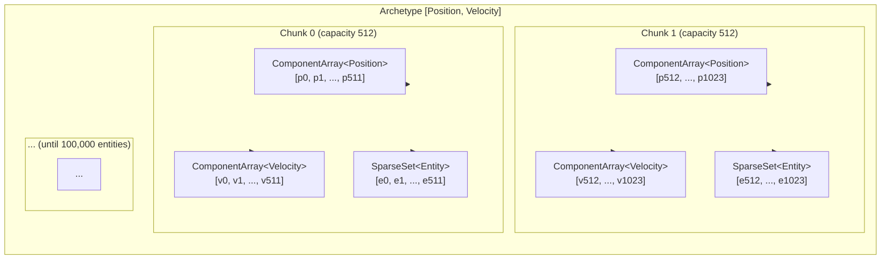

# ArchetypeBuilder

`ArchetypeBuilder` efficiently creates large numbers of entities with the same component layout. It pre-allocates
all chunks at once and populates them in parallel, making it **significantly faster** than calling
`Scene::CreateEntity` in a loop for bulk spawning.

Obtain a builder from the scene:

```cpp
auto builder = scene->CreateArchetypeBuilder();
```

---

## Bulk creation flow

```mermaid
graph TB
    subgraph Build["ArchetypeBuilder Build Process"]
        B["CreateArchetypeBuilder()"]
        WC["WithComponent&lt;Position&gt;(default)"]
        WV["WithComponent&lt;Velocity&gt;(default)"]
        WE["WithEntities(100_000)"]
        FE["ForEach&lt;Position&gt;(customize)"]
        BUILD["Build()"]
        ALLOC["Pre-allocate chunks"]
        REG["Register components on archetype"]
        SPAWN["Create entities in bulk"]
        CALL["Run ForEach callbacks"]
        DONE["Return Ref&lt;Archetype&gt;"]
    end

    B --> WC --> WV --> WE
    WE --> FE
    FE --> BUILD
    BUILD --> ALLOC --> REG --> SPAWN --> CALL --> DONE

```



---

## Basic usage

```cpp
scene->CreateArchetypeBuilder()
    .WithComponent(Position { .x = 0.f, .y = 0.f })
    .WithComponent(Velocity { .dx = 1.f })
    .WithEntities(100'000)
    .Build();
```

This creates 100,000 entities, each with a `Position` initialised to `{0, 0}` and a `Velocity` initialised to
`{dx: 1}`. All entities share a single archetype.

---

## Methods

### `WithComponent<T>(value)`

Declares a component type and sets the **default value** applied to every entity created by this builder.

**Signature:**
```cpp
template <typename T>
    requires IsComponent<T>
ArchetypeBuilder& WithComponent(T component);
```

**Complexity:** $O(1)$ — registers the component type on the archetype and stores the default value function.

**Thread safety:** Not thread-safe.

```cpp
builder.WithComponent(Health { .max = 100, .current = 100 });
```

Template parameter `T` is inferred from the argument type — must satisfy `fr::IsComponent`.

Calling `WithComponent` with the same type more than once is ignored (the first registration wins).

---

### `WithEntities(count)`

Sets the number of entities to create.

**Signature:** `ArchetypeBuilder& WithEntities(Entity entityCount)`

**Complexity:** $O(1)$ — stores the count.

**Thread safety:** Not thread-safe.

```cpp
builder.WithEntities(50'000);
```

Calling `Build()` with `count = 0` returns `nullptr` without creating any entities.

---

### `ForEach<Ts...>(fn)`

Registers a post-creation callback to customise individual entities. The callback receives `(Entity, Ts&...)`
for every entity after they are created.

**Signature:**
```cpp
template <typename... Components>
ArchetypeBuilder& ForEach(auto&& f);
```

**Complexity:** $O(N)$ where N is the entity count — called once per entity during `Build()`.

**Thread safety:** Not thread-safe — callbacks run during `Build()`.

```cpp
builder
    .WithComponent(Position {})
    .WithEntities(1000)
    .ForEach<Position>([](fr::Entity e, Position& pos) {
        pos.x = static_cast<float>(e) * 2.f; // spread entities along X
    });
```

Multiple `ForEach` calls are executed in registration order.

---

### `Build()`

Commits the builder, creates the entities, and returns a `Ref<Archetype>`.

**Signature:** `Ref<Archetype> Build()`

**Complexity:** $O(N + C)$ where N is entity count and C is chunk count. Pre-allocates all chunks,
then populates entities and runs callbacks.

**Thread safety:** Not thread-safe.

```cpp
auto archetype = builder.Build(); // nullptr if WithEntities(0)
```

### Archetype reuse

If an archetype with the same component signature already exists (from a previous `Build()` call or from
`CreateEntity`), the new entities are **appended to the existing archetype** rather than creating a new one.

```cpp
auto a1 = scene->CreateArchetypeBuilder()
    .WithComponent(Position { .x = 0.f })
    .WithEntities(100)
    .Build();

auto a2 = scene->CreateArchetypeBuilder()
    .WithComponent(Position { .x = 999.f })
    .WithEntities(50)
    .Build();

assert(a1 == a2);          // same archetype object
assert(a1->Count() == 150); // 150 total entities across both builds
```

---

## Memory layout during bulk creation



For 100,000 entities with chunk capacity 512: ~196 chunks, each fully packed.

---

## Full example: spawning a grid of enemies

```cpp
// Spawn a 10×10 grid of enemies with unique positions and health values
scene->CreateArchetypeBuilder()
    .WithComponent(Position {})
    .WithComponent(Health { .max = 50, .current = 50 })
    .WithComponent(EnemyTag {})
    .WithEntities(100)
    .ForEach<Position>([](fr::Entity e, Position& pos) {
        pos.x = static_cast<float>(e % 10) * 5.f;
        pos.y = static_cast<float>(e / 10) * 5.f;
    })
    .ForEach<Health>([](fr::Entity, Health& hp) {
        hp.current = hp.max; // ensure full health on spawn
    })
    .Build();
```

---

## When to use `CreateEntity` instead

| Scenario | Use |
|----------|-----|
| **Bulk spawn at startup** (100+ entities with same layout) | `ArchetypeBuilder` |
| **One-off entity during gameplay** | `Scene::CreateEntity` |
| **Mixed component sets per entity** | `Scene::CreateEntity` |
| **Dynamic entity creation based on runtime data** | `Scene::CreateEntity` |

```cpp
// Player fires a bullet — single entity, immediate
scene->CreateEntity(
    Position { mPlayer.x, mPlayer.y },
    Velocity { .dx = 0.f, .dy = 20.f },
    BulletTag {}
);
```
