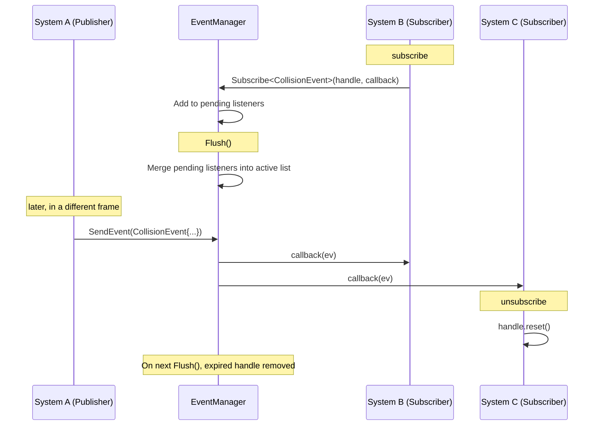

# Events

Freyr's event system provides a **thread-safe publish/subscribe bus** for decoupled communication between systems.
Events carry data from publishers to all active subscribers without direct references between systems.

---

## Defining an event

Inherit from `fr::Event` and add your payload fields:

```cpp
#include <Freyr/Freyr.hpp>

struct CollisionEvent : fr::Event {
    fr::Entity entityA;
    fr::Entity entityB;
    float      impactForce = 0.f;
};

struct EntityDestroyedEvent : fr::Event {
    fr::Entity entity;
    std::string reason;
};
```

Events should be small, trivially copyable POD types for best performance.

---

## Publishing an event

Call `Registry::SendEvent` from anywhere that has access to the registry:

**Signature:** `template <typename T> requires IsEvent<T> void SendEvent(T event)`

**Complexity:** $O(N)$ where N is the number of active listeners.

**Thread safety:** Fully thread-safe. Multiple threads can publish concurrently.

```cpp
// From within a system's Update
void Update(float dt) override {
    mRegistry->CreateQuery()->Each<Position, Collider>(
        [this](fr::Entity a, Position& posA, Collider& colA) {
            // ... detect overlap ...
            mRegistry->SendEvent(CollisionEvent {
                .entityA     = a,
                .entityB     = b,
                .impactForce = 42.f
            });
        });
}
```

!!! note "Synchronous dispatch"
    Events are dispatched **immediately** — all subscribers are called synchronously on the publisher's thread
    before `SendEvent` returns. This means listeners run on the worker thread if called from within `EachAsync`.

---

## Subscribing to an event

### Via `Registry::AddEventListener` (recommended)

**Signature:** `template <typename T> requires IsEvent<T> Ref<ListenerHandle> AddEventListener(auto&& listener)`

**Complexity:** $O(1)$ amortised — appends to pending listener queue.

**Thread safety:** Thread-safe. Subscriptions are queued and merged before the next flush.

```cpp
class ResponseSystem : public fr::System {
public:
    explicit ResponseSystem(const Ref<fr::Registry>& registry) : System(registry) {
        // Subscribe and store the handle
        mCollisionHandle = registry->AddEventListener<CollisionEvent>(
            [this](const CollisionEvent& ev) {
                onCollision(ev);
            });
    }

    void Update(float dt) override {
        // ...
    }

private:
    void onCollision(const CollisionEvent& ev) {
        // apply damage, play sound, etc.
    }

    Ref<fr::ListenerHandle> mCollisionHandle; // keeps subscription alive
};
```

### Via `EventManager` (direct injection)

```cpp
class ResponseSystem : public fr::System {
public:
    ResponseSystem(const Ref<fr::Registry>& registry, Ref<fr::EventManager> events)
        : System(registry)
    {
        mHandle = events->Subscribe<CollisionEvent>(
            [](const CollisionEvent& ev) { /* ... */ });
    }

private:
    Ref<fr::ListenerHandle> mHandle;
};
```

---

## Subscription lifetime

The subscription is **active as long as the `ListenerHandle` shared_ptr is alive**:

```cpp
// Active — mHandle keeps the subscription alive
Ref<fr::ListenerHandle> mHandle = registry->AddEventListener<MyEvent>(...);

// Unsubscribe explicitly
mHandle.reset(); // subscription is now dead — removed on next Flush()
```

!!! danger "Don't discard the handle"
    If you do not store the returned `Ref<ListenerHandle>`, it is destroyed immediately and the callback
    is **never** called:

    ```cpp
    // WRONG — handle destroyed, callback never fires
    registry->AddEventListener<MyEvent>([](const MyEvent&) { ... });

    // CORRECT — store the handle
    mHandle = registry->AddEventListener<MyEvent>([](const MyEvent&) { ... });
    ```

---

## Event lifecycle



---

## Thread safety guarantees

`EventManager` is fully thread-safe:

| Operation | Safe from multiple threads? | Notes |
|-----------|---------------------------|-------|
| `Subscribe` | Yes | Queued into pending list, merged at `Flush()` |
| `SendEvent` | Yes | Dispatches synchronously to active listeners |
| `Flush` | No — call from main thread only | Merges pending, cleans expired |

!!! tip "Thread safety details"
    - The **active listener list** is protected by an `RwLock` — multiple sends can read concurrently
    - The **pending listener list** has a separate `RwLock` — subscriptions don't block sends
    - Listeners registered while `SendEvent` is in progress are queued and merged before the next `Flush()`
    - They will **never** receive the current in-flight event

---

## Event ID

Each event type has a unique runtime ID:

```cpp
fr::EventId id = fr::GetEventId<CollisionEvent>();
```

IDs are assigned sequentially in declaration order.

---

## Complete example: damage/heal system

```cpp
struct DamageEvent : fr::Event {
    fr::Entity target;
    int        amount;
};

struct HealEvent : fr::Event {
    fr::Entity target;
    int        amount;
};

class HealthSystem : public fr::System {
public:
    HealthSystem(const Ref<fr::Registry>& registry) : System(registry) {
        mDamageHandle = registry->AddEventListener<DamageEvent>(
            [this](const DamageEvent& ev) {
                mRegistry->TryGetComponents<Health>(ev.target,
                    [&](Health& hp) { hp.current -= ev.amount; });
            });

        mHealHandle = registry->AddEventListener<HealEvent>(
            [this](const HealEvent& ev) {
                mRegistry->TryGetComponents<Health>(ev.target,
                    [&](Health& hp) {
                        hp.current = std::min(hp.current + ev.amount, hp.max);
                    });
            });
    }

private:
    Ref<fr::ListenerHandle> mDamageHandle;
    Ref<fr::ListenerHandle> mHealHandle;
};
```
