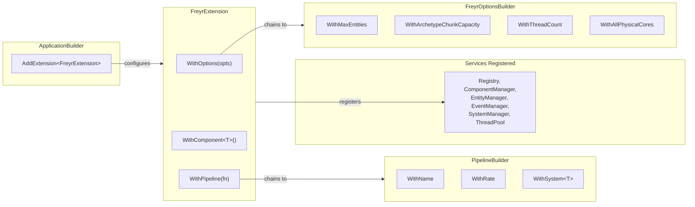

# FreyrExtension

`fr::FreyrExtension` integrates Freyr into a [Skirnir](https://github.com/gilmar-sales/skirnir) application.
It registers all services (Registry, managers, thread pool) into the DI container and wires up components and
systems before the application starts.

---

## Registration

Pass it to `skr::ApplicationBuilder::AddExtension` with a configuration lambda:

```cpp
skr::ApplicationBuilder()
    .AddExtension<fr::FreyrExtension>([](fr::FreyrExtension& freyr) {
        freyr
            .WithOptions([](fr::FreyrOptionsBuilder& opts) {
                opts.WithMaxEntities(500'000)
                    .WithThreadCount(4);
            })
            .WithComponent<Position>()
            .WithComponent<Velocity>()
            .WithPipeline([](fr::PipelineBuilder& pipeline) {
                pipeline.WithName("Main")
                    .WithRate(60.0f)
                    .WithSystem<MovementSystem>()
                    .WithSystem<CollisionSystem>();
            });
    })
    .Build<MyApp>();
```

All `With*` calls return `*this`, so they can be chained freely.

---

## Configuration flow



---

## Methods

### `WithComponent<T>()`

Registers a component type with the `ComponentManager`.

**Signature:** `template <typename T> requires IsComponent<T> FreyrExtension& WithComponent()`

**Complexity:** $O(1)$ — inserts into registered components set.

**Thread safety:** Not thread-safe — call during application setup only.

```cpp
freyr.WithComponent<TransformComponent>();
```

!!! warning "Required registration"
    Every component type used in the application **must** be registered before the first entity that uses it.
    Failing to register a component results in a runtime assertion (`FREYR_ASSERT`).

**Template parameter:**
- `T` — must satisfy `fr::IsComponent` (i.e. inherit from `fr::Component`)

---

### `WithPipeline(fn)`

Defines a pipeline containing systems. Systems are constructed in registration order within each pipeline.

**Signature:**
`FreyrExtension& WithPipeline(std::function<void(PipelineBuilder&)> callback)`

**Complexity:** $O(1)$ per call — appends a pipeline config to internal vector.

**Thread safety:** Not thread-safe — call during application setup only.

```cpp
freyr.WithPipeline([](fr::PipelineBuilder& pipeline) {
    pipeline.WithName("Physics")
        .WithRate(60.0f)
        .WithSystem<PhysicsSystem>();
});
```

If a system needs an `EventManager`, Skirnir resolves it automatically:

```cpp
class PhysicsSystem : public fr::System {
public:
    PhysicsSystem(const skr::Arc<fr::Registry>& registry, skr::Arc<fr::EventManager> events)
        : System(registry), mEvents(events) {}
    // ...
};
```

**Callback parameter:**
- `fn` — receives a `PipelineBuilder` to configure the pipeline

See [`PipelineBuilder`](pipeline-builder.md) for pipeline configuration options.

---

### `WithOptions(fn)`

Configures runtime parameters via a `FreyrOptionsBuilder` callback.

**Signature:**
`FreyrExtension& WithOptions(const std::function<void(FreyrOptionsBuilder&)>& func)`

**Complexity:** $O(1)$.

**Thread safety:** Not thread-safe — call during application setup only.

```cpp
freyr.WithOptions([](fr::FreyrOptionsBuilder& opts) {
    opts.WithMaxEntities(1'000'000)
        .WithArchetypeChunkCapacity(512)
        .WithThreadCount(std::thread::hardware_concurrency());
});
```

See [`FreyrOptionsBuilder`](options-builder.md) for all available options.

---

## Full bootstrap example

```cpp
int main() {
    auto app = skr::ApplicationBuilder()
        .AddExtension<fr::FreyrExtension>([](fr::FreyrExtension& freyr) {
            freyr
                .WithOptions([](fr::FreyrOptionsBuilder& opts) {
                    opts
                        .WithMaxEntities(2'000'000)
                        .WithArchetypeChunkCapacity(512)
                        .WithAllPhysicalCores();
                })
                .WithComponent<Position>()
                .WithComponent<Velocity>()
                .WithComponent<Health>()
                .WithComponent<PlayerTag>()
                .WithPipeline([](fr::PipelineBuilder& pipeline) {
                    pipeline.WithName("Physics")
                        .WithRate(60.0f)
                        .WithSystem<MovementSystem>()
                        .WithSystem<CollisionSystem>();
                })
                .WithPipeline([](fr::PipelineBuilder& pipeline) {
                    pipeline.WithName("AI")
                        .WithRate(10.0f)
                        .WithSystem<AISystem>();
                });
        })
        .Build<MyApp>();

    app->Run();
}
```
