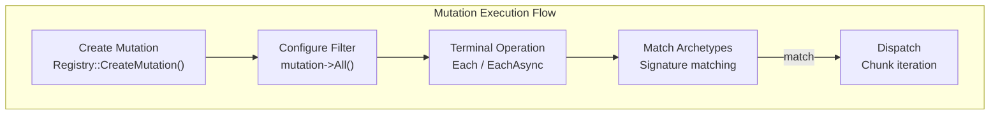

# Mutation

`fr::Mutation` provides a fluent API for write operations on entities — creating, destroying, and modifying
component data. Mutations support deferred execution via `MutationAggregator` and both synchronous and
asynchronous iteration.

Obtain a Mutation instance via [`Registry::CreateMutation()`](scene.md#createmutation):

```cpp
auto mutation = registry->CreateMutation();
```

---

## Mutation flow



---

## Filter methods

### `All<Ts...>`

Sets the component **inclusion filter**. Only entities having all specified component types are processed.

**Signature:**
```cpp
template <typename... Ts>
    requires(IsComponent<Ts> and ...)
Mutation& All();
```

**Complexity:** $O(K)$ where K is the number of component types — updates the inclusion signature bitset.

**Thread safety:** Not thread-safe — the filter is local to this mutation instance.

```cpp
mutation->All<Position, Velocity>();
```

!!! note "Inclusion vs exclusion"
    The **inclusion filter** is specified explicitly via `All<Ts...>()`.
    The **exclusion filter** can be used via `Excluding<Ts...>()`.

---

## Terminal operations

### `Each<Ts...>`

Synchronously iterates over all matching entities, invoking the callback for each.

**Signature:**
```cpp
template <typename... Ts>
    requires(IsComponent<Ts> and ...)
Mutation& Each(auto&& action);
```

**Complexity:** $O(N)$ where N is the number of matching entities.

**Thread safety:** Not thread-safe — runs on the calling thread.

```cpp
mutation->All<Position, Velocity>()
    ->Each([](Entity e, Position& pos, Velocity& vel) {
        pos.x += vel.dx * dt;
    });
```

### `EachAsync<Ts...>`

Dispatches chunk tasks to the thread pool for parallel execution.

**Signature:**
```cpp
template <typename... Ts>
    requires(IsComponent<Ts> and ...)
Mutation& EachAsync(auto&& action);
```

**Complexity:** $O(N)$ total work, distributed across threads. $O(C)$ overhead where C is chunk count.

**Thread safety:** The action callback must be safe for concurrent invocation on different entities.
Each entity is processed by exactly one thread.

```cpp
mutation->All<Position, Velocity>()
    ->WithLabel("Physics::Integrate")
    ->EachAsync([](Entity e, Position& pos, Velocity& vel) {
        pos.x += vel.dx * dt;
    });
registry->ExecuteTasks(); // wait for completion
```

| Method      | Blocking | Thread pool | Use when |
|-------------|----------|-------------|----------|
| `Each`      | Yes      | No          | Sequential, ordered, cross-entity writes |
| `EachAsync` | No       | Yes         | Independent entities, parallel execution |

---

## Utility methods

### `WithLabel`

Assigns a human-readable label for profiling and debugging.

**Signature:**
```cpp
Mutation& WithLabel(const std::string_view name);
```

**Complexity:** $O(1)$ — copies the label string.

**Thread safety:** Not thread-safe.

```cpp
mutation->WithLabel("PhysicsUpdate");
```

When `FREYR_PROFILING=ON`, the label appears in Perfetto traces as the trace event name.

---

## Important notes

- Mutation instances should **not be stored long-term** as they hold references to `ComponentManager`
- Use `Registry::CreateMutation()` to obtain a fresh mutation instance when needed
- The `MutationAggregator` coordinates async mutation execution across worker threads
- Callbacks passed to `Each` and `EachAsync` **must not throw** — behaviour is undefined in parallel execution
- `EachAsync` callbacks must not call `Registry::Update` or `DestroyEntity` for entities being iterated