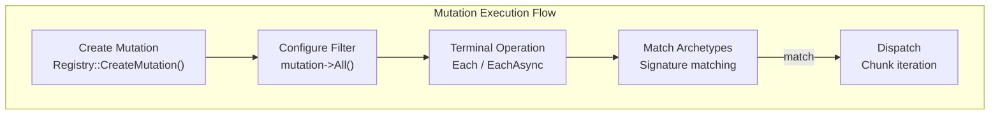

# Mutation

`fr::Mutation` provides a fluent API for write operations on entities — creating, destroying, and modifying
component data. Mutations support deferred execution via `MutationAggregator` and both synchronous and
asynchronous iteration.

Obtain a Mutation instance via [`Registry::CreateMutation()`](scene.md#createmutation):

```cpp
auto mutation = registry->CreateMutation();
```

---

## Mutation flow


```mermaid
graph TB
    subgraph MutationFlow["Mutation Execution Flow"]
        Q["Create Mutation<br/>Registry::CreateMutation()"]
        F["Configure Filter<br/>mutation->All<Ts...>()"]
        T["Terminal Operation<br/>Each / EachAsync"]
        M["Match Archetypes<br/>Signature matching"]
        D["Dispatch<br/>Chunk iteration"]
    end

    Q --> F --> T
    T --> M
    M -->|match| D

```

---

## Filter methods

### `All<Ts...>`

Sets the component **inclusion filter**. Only entities having all specified component types are processed.

**Signature:**
```cpp
template <typename... Ts>
    requires(IsComponent<Ts> and ...)
Mutation& All();
```

**Complexity:** $O(K)$ where K is the number of component types — updates the inclusion signature bitset.

**Thread safety:** Not thread-safe — the filter is local to this mutation instance.

```cpp
mutation->All<Position, Velocity>();
```

!!! note "Inclusion vs exclusion"
    The **inclusion filter** is specified explicitly via `All<Ts...>()` (terminal ops like
    `Each` / `EachAsync` set it implicitly from the callable's component parameters).
    The **exclusion filter** is specified via `Excluding<Ts...>()`.

### `Excluding<Ts...>`

Adds component types to the **exclusion filter**. `Disabled` and `Prefab` are excluded
by default (inherited from the `Filter` constructor).

**Signature:**
```cpp
template <typename... Ts>
    requires(IsComponent<Ts> and ...)
Mutation& Excluding();
```

```cpp
mutation->Excluding<Disabled>()->Each([](Position& pos) { /* ... */ });
```

### `IncludingDisabled()` / `IncludingPrefabs()`

Removes `Disabled` / `Prefab` from the exclusion filter.

**Signatures:** `Mutation& IncludingDisabled();` / `Mutation& IncludingPrefabs();`

### `Changed<Ts...>` / `Added<Ts...>` / `Removed<Ts...>`

Restricts matches by per-component change ticks. `Each` / `EachAsync` mark the
iterated components as changed at the current tick after running the callback.

**Signatures:**
```cpp
template <typename... Ts> requires(IsComponent<Ts> and ...) Mutation& Changed();
template <typename... Ts> requires(IsComponent<Ts> and ...) Mutation& Added();
template <typename... Ts> requires(IsComponent<Ts> and ...) Mutation& Removed();
```

---

## Terminal operations

### `Each`

Synchronously iterates over all matching entities, invoking the callback for each.

Component types are **deduced** from the callable signature via C++26 reflection:

**Signature:**
```cpp
template <typename F>
Mutation& Each(F&& action);
```

**Deduction rules:**

- Optional leading `Entity` / `fr::Entity` is skipped — it **must** be typed (never `auto`)
- Remaining parameters must be **concrete** component types (`Position&`, not `auto&`)
- At least one component parameter is required

**Complexity:** $O(N)$ where N is the number of matching entities.

**Thread safety:** Not thread-safe — runs on the calling thread.

```cpp
mutation->Each([](fr::Entity entity, Position& pos, Velocity& vel) {
    pos.x += vel.dx * dt;
});

// Entity parameter is optional
mutation->Each([](Position& pos) {
    pos.x *= 0.99f;
});
```

### `EachAsync`

Dispatches chunk tasks to the thread pool for parallel execution. Same deduction rules as `Each`.

**Signature:**
```cpp
template <typename F>
Mutation& EachAsync(F&& action);
```

**Complexity:** $O(N)$ total work, distributed across threads. $O(C)$ overhead where C is chunk count.

**Thread safety:** The action callback must be safe for concurrent invocation on different entities.
Each entity is processed by exactly one thread.

```cpp
mutation->WithLabel("Physics::Integrate")
    ->EachAsync([](fr::Entity entity, Position& pos, Velocity& vel) {
        pos.x += vel.dx * dt;
    });
registry->ExecuteTasks(); // wait for completion when outside Update
```

| Method      | Blocking | Thread pool | Use when |
|-------------|----------|-------------|----------|
| `Each`      | Yes      | No          | Sequential, ordered, cross-entity writes |
| `EachAsync` | No       | Yes         | Independent entities, parallel execution |

---

## Utility methods

### `WithLabel`

Assigns a human-readable label for profiling and debugging.

**Signature:**
```cpp
Mutation& WithLabel(const std::string_view name);
```

**Complexity:** $O(1)$ — copies the label string.

**Thread safety:** Not thread-safe.

```cpp
mutation->WithLabel("PhysicsUpdate");
```

When `FREYR_PROFILING=ON`, a single matching mutation uses the label as the duration event
name. Multiple mutations fused into one chunk pass keep entity-major batching: the duration
span is `MutationBatch`, and each label is emitted as an instant event so names stay searchable.

---

## Important notes

- Mutation instances should **not be stored long-term** as they hold references to `ComponentManager`
- Use `Registry::CreateMutation()` to obtain a fresh mutation instance when needed
- The `MutationAggregator` coordinates async mutation execution across worker threads
- Callbacks passed to `Each` and `EachAsync` **must not throw** — behaviour is undefined in parallel execution
- `EachAsync` callbacks must not call `Registry::Update` or `DestroyEntity` for entities being iterated
