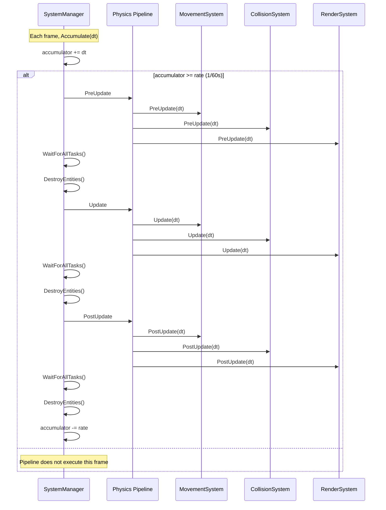

# PipelineBuilder

`PipelineBuilder` defines a named collection of systems that run at a specific update rate. Pipelines allow
you to organize systems into logical groups with different execution frequencies.

Obtain a builder from `FreyrExtension::WithPipeline()`:

```cpp
freyr.WithPipeline([](fr::PipelineBuilder& pipeline) {
    pipeline.WithName("Main")
        .WithRate(60.0f)
        .WithSystem<MovementSystem>()
        .WithSystem<RenderSystem>();
});
```

---

## Pipeline lifecycle



---

## Methods

### `WithName(name)`

Sets the pipeline's display name, used in profiling traces and debugging.

**Signature:** `PipelineBuilder& WithName(const std::string_view name)`

**Complexity:** $O(1)$.

**Thread safety:** Not thread-safe — call during application setup.

| Parameter | Type | Default |
|-----------|------|---------|
| `name` | `std::string_view` | `"Pipeline {id}"` |

```cpp
pipeline.WithName("Physics");
```

---

### `WithRate(rate)`

Sets the target update rate for this pipeline in Hz. The pipeline will be scheduled to run at this frequency.

**Signature:** `PipelineBuilder& WithRate(const float rate)`

**Complexity:** $O(1)$.

**Thread safety:** Not thread-safe — call during application setup.

| Parameter | Type | Default |
|-----------|------|---------|
| `rate` | `float` | `0.0` (runs every frame) |

```cpp
pipeline.WithRate(60.0f); // 60 Hz → updates every 16.67ms
pipeline.WithRate(30.0f); // 30 Hz → updates every 33.33ms
pipeline.WithRate(0.0f);  // every frame
```

!!! note "Rate conversion"
    The builder converts `rate` → interval: `interval = rate > 0 ? 1.0f / rate : 0.0f`.
    An interval of `0.0f` means the pipeline runs every frame.

**Use cases for different rates:**

| Rate  | Typical use          |
|-------|----------------------|
| 0     | Rendering, input     |
| 60    | Physics, movement    |
| 30    | Mid-frequency checks |
| 10    | AI, pathfinding      |
| 1-5   | Inventory, economy   |

---

### `WithSystem<T>()`

Registers a system type to this pipeline. Systems execute in registration order within each phase.
Runtime `Registry::RegisterSystem` / `SystemManager::RegisterSystem` also **append** after any
systems registered here (no insert-at-index API yet).

**Signature:** `template <typename T> requires IsSystem<T> PipelineBuilder& WithSystem()`

**Complexity:** $O(1)$ — appends factory function to internal lists.

**Thread safety:** Not thread-safe — call during application setup.

```cpp
pipeline
    .WithSystem<InputSystem>()       // executes first
    .WithSystem<MovementSystem>()    // depends on input
    .WithSystem<CollisionSystem>()   // depends on movement
    .WithSystem<RenderSystem>();     // depends on everything
```

!!! tip "System registration also registers DI services"
    Each `WithSystem<T>()` call automatically registers the system as a singleton in Skirnir's DI container:
    ```cpp
    services.AddSingleton<T>();
    ```
    This means systems can inject dependencies via constructor parameters.

**Template parameter:**
- `T` — must satisfy `fr::IsSystem` (i.e. inherit from `fr::System`).

---

## Multiple pipeline configurations

Define separate pipelines for different subsystems:

```cpp
freyr
    .WithPipeline([](fr::PipelineBuilder& physics) {
        physics.WithName("Physics")
            .WithRate(60.0f)
            .WithSystem<PhysicsSystem>()
            .WithSystem<CollisionSystem>();
    })
    .WithPipeline([](fr::PipelineBuilder& ai) {
        ai.WithName("AI")
            .WithRate(10.0f)
            .WithSystem<MonsterSystem>()
            .WithSystem<NPCSystem>();
    })
    .WithPipeline([](fr::PipelineBuilder& render) {
        render.WithName("Render")
            .WithRate(0.0f) // every frame
            .WithSystem<RenderSystem>();
    });
```

---

## System execution order

Within a pipeline, systems execute in registration order during each lifecycle phase.
If `SystemB` depends on results produced by `SystemA`, register `SystemA` first:

```cpp
pipeline.WithSystem<InputSystem>()      // runs first
        .WithSystem<MovementSystem>()   // uses input
        .WithSystem<CollisionSystem>()  // uses movement
        .WithSystem<RenderSystem>();    // runs last
```

!!! warning "Cross-entity dependencies"
    For data dependencies *within* a system's callback, use `ForEach` (sequential) rather than `ForEachAsync`
    when the callback reads from other entities. `EachAsync` is safe only when entities are independent.
