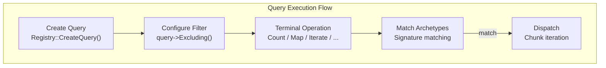

# Query

`fr::Query` provides a fluent API for **read-only** filtering and querying of entities by their component
composition. For write operations, use [`Mutation`](mutation.md).

Obtain a Query instance via [`Registry::CreateQuery()`](registry.md#createquery):

```cpp
auto query = registry->CreateQuery();
```

---

## Query flow



---

## Filter methods

### `Excluding<Ts...>`

Adds component types to the **exclusion filter**. Entities with any of the specified components are excluded
from query results.

**Signature:**
```cpp
template <typename... Ts>
    requires(IsComponent<Ts> and ...)
Query& Excluding();
```

**Complexity:** $O(K)$ where K is the number of excluded types — updates the exclusion signature bitset.

**Thread safety:** Not thread-safe — the filter is local to this query instance.

```cpp
query->Excluding<DisabledTag, EditorOnly>();
```

!!! note "Inclusion vs exclusion"
    For packed terminals (`Count`, `First`, `FindUnique`, `EntitiesWith`, `Iterate`), the **inclusion filter**
    comes from the component template arguments (e.g. `Count<Position, Velocity>`).
    For `Transform` / `Map` / `Reduce`, inclusion is **deduced from the callable** parameters.
    The **exclusion filter** is always specified explicitly via `Excluding<Ts...>()`.

---

## Terminal operations

### `Count<Ts...>`

Returns the total number of entities having all specified component types.

**Signature:**
```cpp
template <typename... Ts>
    requires(IsComponent<Ts> and ...)
std::size_t Count();
```

**Complexity:** $O(A)$ where A is the number of archetypes — iterates all archetypes, sums matching counts.

**Thread safety:** Not thread-safe — reads archetype data on the calling thread.

```cpp
auto alive = query->Count<Health>();
auto movable = query->Excluding<StunnedTag>()->Count<Position, Velocity>();
```

---

### `EntitiesWith<Ts...>`

Returns all entity IDs that have all specified component types.

**Signature:**
```cpp
template <typename... Ts>
    requires(IsComponent<Ts> and ...)
std::vector<Entity> EntitiesWith();
```

**Complexity:** $O(N)$ where N is the total number of matching entities — collects entity IDs from all chunks.

**Thread safety:** Not thread-safe — reads archetype data on the calling thread.

```cpp
auto players = query->Excluding<DeadTag>()
    ->EntitiesWith<PlayerTag, Health>();
```

!!! performance "Vector allocation"
    `EntitiesWith` allocates a new vector each call. For frequent use, prefer `Map` / `Reduce` /
    `Iterate` only when you need the results, or use [`Mutation`](mutation.md) for in-place updates.

---

### `FindUnique<Ts...>`

Returns the single matching entity, or `std::nullopt` if zero or more than one entity matches.

**Signature:**
```cpp
template <typename... Ts>
    requires(IsComponent<Ts> and ...)
std::optional<Entity> FindUnique();
```

**Complexity:** $O(A)$ where A is the number of archetypes — early-exits on second match.

**Thread safety:** Not thread-safe.

```cpp
auto camera = query->FindUnique<CameraComponent>();
if (camera.has_value()) {
    // exactly one entity has a CameraComponent
}
```

!!! tip "Use for singletons"
    `FindUnique` is ideal for singleton entities like the camera, player character, or world settings.

---

### `First<Ts...>`

Returns the first entity matching the query, or `std::nullopt` if none found.

**Signature:**
```cpp
template <typename... Ts>
    requires(IsComponent<Ts> and ...)
std::optional<Entity> First();
```

**Complexity:** $O(A)$ where A is the number of archetypes — stops at first match.

**Thread safety:** Not thread-safe.

```cpp
auto entity = query->First<PlayerTag>();
```

---

### `Iterate<Ts...>`

Collects all matching entities and their components into a vector of tuples.

**Signature:**
```cpp
template <typename... Ts>
    requires(IsComponent<Ts> and ...)
auto Iterate() -> std::vector<std::tuple<Entity, Ts...>>;
```

**Complexity:** $O(N)$ where N is the total number of matching entities. Allocates a vector of tuples.

**Thread safety:** Not thread-safe.

```cpp
auto entities = query->Iterate<Position, Velocity>();
for (auto&& [entity, pos, vel] : entities) {
    // process each entity with its components
}
```

!!! warning "Memory usage"
    `Iterate` copies component data into tuples. For large in-place updates, use
    [`Mutation::Each` / `EachAsync`](mutation.md) instead of materializing a query result.

---

### `Transform`

Maps each entity to a transformed value and returns a vector of results.
Component types are **deduced from the callable** — do not pass an explicit `<Ts...>` pack.

**Signature:**
```cpp
template <typename F>
auto Transform(F&& callback) -> std::vector</* return type of callback */>;
```

**Complexity:** $O(N)$ where N is the number of matching entities. Allocates a vector of results.

**Thread safety:** Not thread-safe.

Callback can accept either `(Entity, Components&...)` or `(Components&...)`.
When the entity is present, it **must** be typed as `fr::Entity` / `Entity` (never `auto`):

```cpp
// With entity ID (typed Entity required)
auto distances = query->Transform(
    [origin](fr::Entity e, Position& pos) {
        return distance(origin, pos);
    });

// Without entity ID
auto healthValues = query->Transform(
    [](Health& h) { return h.current; });
```

---

### `Map`

Applies a transform function and returns results as a vector, ordered by entity.
Component types are **deduced from the callable** — do not pass an explicit `<Ts...>` pack.

**Signature:**
```cpp
template <typename F>
auto Map(F&& f) -> std::vector</* return type of callback */>;
```

**Complexity:** $O(N)$ where N is the number of matching entities. Pre-allocates result vector.

**Thread safety:** Not thread-safe.

Same callable rules as `Transform` (typed `Entity` when present):

```cpp
auto distances = query->Map(
    [origin](fr::Entity e, Position& pos) {
        float dx = pos.x - origin.x;
        float dy = pos.y - origin.y;
        return std::sqrt(dx*dx + dy*dy);
    });
```

Unlike `Transform`, `Map` pre-allocates the result vector and fills by index.

---

### `Reduce`

Accumulates values across all matching entities.
Component types are **deduced from parameters after the accumulator** — do not pass an explicit `<Ts...>` pack.

**Signature:**
```cpp
template <typename F, typename Seed>
auto Reduce(F&& callback, Seed seed) -> Seed;
```

**Complexity:** $O(N)$ where N is the number of matching entities.

**Thread safety:** Not thread-safe — runs on the calling thread.

Callback signature: `(Acc, Components&...) -> Acc`:

```cpp
// Sum all health
auto totalHealth = query->Reduce(
    [](float acc, Health& h) { return acc + h.current; },
    0.f);

// Find max velocity
auto maxSpeed = query->Reduce(
    [](float acc, Velocity& v) {
        float speed = std::sqrt(v.dx*v.dx + v.dy*v.dy + v.dz*v.dz);
        return std::max(acc, speed);
    },
    0.f);
```

---

## Writing components

`Query` is **read-oriented**. For in-place component updates (sync or parallel per chunk), use
[`Mutation`](mutation.md):

```cpp
registry->CreateMutation()
    ->WithLabel("UpdatePositions")
    ->EachAsync([](Entity e, Position& pos, Velocity& vel) {
        pos.x += vel.dx * dt;
    });
```

---

## Utility methods

### `WithLabel`

Assigns a human-readable label for profiling and debugging.

**Signature:**
```cpp
Query& WithLabel(const std::string_view name);
```

**Complexity:** $O(1)$ — copies the label string.

**Thread safety:** Not thread-safe.

```cpp
query->WithLabel("PhysicsUpdate");
```

When `FREYR_PROFILING=ON`, the label appears in Perfetto traces as the trace event name.

---

## Important notes

- Query instances should **not be stored long-term** as they hold references to `ComponentManager`
- Use `Registry::CreateQuery()` to obtain a fresh query instance when needed
- Prefer [`Mutation`](mutation.md) for write iteration (`Each` / `EachAsync`)
- Exclusion filters reject archetypes that have **any** of the excluded components (`Signature::Intersects`)
