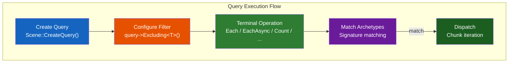

# Query

`fr::Query` provides a fluent API for filtering and querying entities by their component composition.
Queries support exclusion filters and various terminal operations for collecting or processing matching entities.

Obtain a Query instance via [`Scene::CreateQuery()`](scene.md#createquery):

```cpp
auto query = scene->CreateQuery();
```

---

## Query flow



---

## Filter methods

### `Excluding<Ts...>`

Adds component types to the **exclusion filter**. Entities with any of the specified components are excluded
from query results.

**Signature:**
```cpp
template <typename... Ts>
    requires(IsComponent<Ts> and ...)
Query& Excluding();
```

**Complexity:** $O(K)$ where K is the number of excluded types — updates the exclusion signature bitset.

**Thread safety:** Not thread-safe — the filter is local to this query instance.

```cpp
query->Excluding<DisabledTag, EditorOnly>();
```

!!! note "Inclusion vs exclusion"
    The **inclusion filter** is specified implicitly via the component template arguments on terminal operations
    (e.g. `Count<Position, Velocity>` includes entities with both Position and Velocity).
    The **exclusion filter** is specified explicitly via `Excluding<Ts...>()`.

---

## Terminal operations

### `Count<Ts...>`

Returns the total number of entities having all specified component types.

**Signature:**
```cpp
template <typename... Ts>
    requires(IsComponent<Ts> and ...)
std::size_t Count();
```

**Complexity:** $O(A)$ where A is the number of archetypes — iterates all archetypes, sums matching counts.

**Thread safety:** Not thread-safe — reads archetype data on the calling thread.

```cpp
auto alive = query->Count<Health>();
auto movable = query->Excluding<StunnedTag>()->Count<Position, Velocity>();
```

---

### `EntitiesWith<Ts...>`

Returns all entity IDs that have all specified component types.

**Signature:**
```cpp
template <typename... Ts>
    requires(IsComponent<Ts> and ...)
std::vector<Entity> EntitiesWith();
```

**Complexity:** $O(N)$ where N is the total number of matching entities — collects entity IDs from all chunks.

**Thread safety:** Not thread-safe — reads archetype data on the calling thread.

```cpp
auto players = query->Excluding<DeadTag>()
    ->EntitiesWith<PlayerTag, Health>();
```

!!! performance "Vector allocation"
    `EntitiesWith` allocates a new vector each call. For frequent use, prefer `Each` or `EachAsync` iteration
    to avoid allocation overhead.

---

### `FindUnique<Ts...>`

Returns the single matching entity, or `std::nullopt` if zero or more than one entity matches.

**Signature:**
```cpp
template <typename... Ts>
    requires(IsComponent<Ts> and ...)
std::optional<Entity> FindUnique();
```

**Complexity:** $O(A)$ where A is the number of archetypes — early-exits on second match.

**Thread safety:** Not thread-safe.

```cpp
auto camera = query->FindUnique<CameraComponent>();
if (camera.has_value()) {
    // exactly one entity has a CameraComponent
}
```

!!! tip "Use for singletons"
    `FindUnique` is ideal for singleton entities like the camera, player character, or world settings.

---

### `First<Ts...>`

Returns the first entity matching the query, or `std::nullopt` if none found.

**Signature:**
```cpp
template <typename... Ts>
    requires(IsComponent<Ts> and ...)
std::optional<Entity> First();
```

**Complexity:** $O(A)$ where A is the number of archetypes — stops at first match.

**Thread safety:** Not thread-safe.

```cpp
auto entity = query->First<PlayerTag>();
```

---

### `Iterate<Ts...>`

Collects all matching entities and their components into a vector of tuples.

**Signature:**
```cpp
template <typename... Ts>
    requires(IsComponent<Ts> and ...)
auto Iterate() -> std::vector<std::tuple<Entity, Ts...>>;
```

**Complexity:** $O(N)$ where N is the total number of matching entities. Allocates a vector of tuples.

**Thread safety:** Not thread-safe.

```cpp
auto entities = query->Iterate<Position, Velocity>();
for (auto&& [entity, pos, vel] : entities) {
    // process each entity with its components
}
```

!!! warning "Memory usage"
    `Iterate` copies component data into tuples. For large result sets, prefer `Each` or `EachAsync`
    which process data in-place without copying.

---

### `Transform<Ts...>`

Maps each entity to a transformed value and returns a vector of results.

**Signature:**
```cpp
template <typename... Ts>
    requires(IsComponent<Ts> and ...)
auto Transform(auto&& callback) -> std::vector<decltype(callback(...))>;
```

**Complexity:** $O(N)$ where N is the number of matching entities. Allocates a vector of results.

**Thread safety:** Not thread-safe.

Callback can accept either `(Entity, Ts&...)` or `(Ts&...)`:

```cpp
// With entity ID
auto distances = query->Transform<Position>(
    [origin](Entity e, Position& pos) {
        return distance(origin, pos);
    });

// Without entity ID
auto healthValues = query->Transform<Health>(
    [](Health& h) { return h.current; });
```

---

### `Map<Ts...>`

Applies a transform function and returns results as a vector, ordered by entity.

**Signature:**
```cpp
template <typename... Ts>
    requires(IsComponent<Ts> and ...)
auto Map(auto&& f) -> std::vector<decltype(callback(...))>;
```

**Complexity:** $O(N)$ where N is the number of matching entities. Pre-allocates result vector.

**Thread safety:** Not thread-safe.

```cpp
auto distances = query->Map<Position>(
    [origin](Entity e, Position& pos) {
        float dx = pos.x - origin.x;
        float dy = pos.y - origin.y;
        return std::sqrt(dx*dx + dy*dy);
    });
```

Unlike `Transform`, `Map` pre-allocates the result vector and fills by index.

---

### `Reduce<Ts...>`

Accumulates values across all matching entities.

**Signature:**
```cpp
template <typename... Ts>
    requires(IsComponent<Ts> and ...)
auto Reduce(auto&& callback, auto seed) -> decltype(seed);
```

**Complexity:** $O(N)$ where N is the number of matching entities.

**Thread safety:** Not thread-safe — runs on the calling thread.

Callback signature: `(ResultType, Ts&...) -> ResultType`:

```cpp
// Sum all health
auto totalHealth = query->Reduce<Health>(
    [](float acc, Health& h) { return acc + h.current; },
    0.f);

// Find max velocity
auto maxSpeed = query->Reduce<Velocity>(
    [](float acc, Velocity& v) {
        float speed = std::sqrt(v.dx*v.dx + v.dy*v.dy + v.dz*v.dz);
        return std::max(acc, speed);
    },
    0.f);
```

---

## Iteration methods

### `Each<Ts...>`

Synchronous iteration over all matching entities.

**Signature:**
```cpp
template <typename... Ts>
    requires(IsComponent<Ts> and ...)
Query& Each(auto&& action);
```

**Complexity:** $O(N)$ where N is the number of matching entities.

**Thread safety:** Runs on the calling thread. Safe for cross-entity reads/writes.

```cpp
query->WithLabel("UpdatePositions")
    ->Each<Position, Velocity>([](Entity e, Position& pos, Velocity& vel) {
        pos.x += vel.dx * dt;
    });
```

### `EachAsync<Ts...>`

Dispatches chunk tasks to the thread pool for parallel execution.

**Signature:**
```cpp
template <typename... Ts>
    requires(IsComponent<Ts> and ...)
Query& EachAsync(auto&& action);
```

**Complexity:** $O(N)$ total work, distributed across threads. $O(C)$ overhead where C is chunk count.

**Thread safety:** The action callback must be safe for concurrent invocation on different entities.
Each entity is processed by exactly one thread.

```cpp
query->WithLabel("Physics::Integrate")
    ->EachAsync<Position, Velocity>([](Entity e, Position& pos, Velocity& vel) {
        pos.x += vel.dx * dt;
    });
scene->ExecuteTasks(); // wait for completion
```

| Method      | Blocking | Thread pool | Use when |
|-------------|----------|-------------|----------|
| `Each`      | Yes      | No          | Sequential, ordered, cross-entity reads |
| `EachAsync` | No       | Yes         | Independent entities, parallel execution |

---

## Utility methods

### `WithLabel`

Assigns a human-readable label for profiling and debugging.

**Signature:**
```cpp
Query& WithLabel(const std::string_view name);
```

**Complexity:** $O(1)$ — copies the label string.

**Thread safety:** Not thread-safe.

```cpp
query->WithLabel("PhysicsUpdate");
```

When `FREYR_PROFILING=ON`, the label appears in Perfetto traces as the trace event name.

---

## Important notes

- Query instances should **not be stored long-term** as they hold references to `ComponentManager`
- Use `Scene::CreateQuery()` to obtain a fresh query instance when needed
- The `QueryAggregator` coordinates async query execution across worker threads
- Callbacks passed to `Each` and `EachAsync` **must not throw** — behaviour is undefined in parallel execution
- `EachAsync` callbacks must not call `Scene::Update` or `DestroyEntity` for entities being iterated
