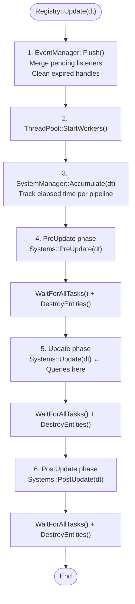

# Registry

`fr::Registry` is the central orchestrator of Freyr. It provides the full entity lifecycle API, component
operations, event helpers, and the main update loop.

Obtain an instance from the service provider:

```cpp
class MyApp : public skr::IApplication {
public:
    explicit MyApp(const Ref<skr::ServiceProvider>& sp) : IApplication(sp) {
        mRegistry = sp->GetService<fr::Registry>();
    }
};
```

---

## Entity management

### `CreateEntity`

Creates a new entity, optionally with initial component values.

**Signature:**
```cpp
// Create with component values, returns entity ID
template <typename... Ts>
    requires(IsComponent<Ts> and ...)
Entity CreateEntity(const Ts&... components);

// Create with component values and a callback
template <typename... Ts, typename TFunc>
    requires(IsComponent<Ts> and ...) and (not IsComponent<TFunc>)
void CreateEntity(TFunc&& callback, const Ts&... components);
```

**Complexity:** $O(1)$ amortised — allocates entity ID and registers components.

**Thread safety:** Not thread-safe — call from main thread or within a system's lifecycle hook.

```cpp
// No components — entity exists but has no data
fr::Entity e = registry->CreateEntity();

// With initial components
fr::Entity e = registry->CreateEntity(
    Position { .x = 10.f },
    Velocity {}
);

// Via callback — receives the entity ID immediately
registry->CreateEntity([](fr::Entity e) {
    // e is available here immediately
}, Position {}, Velocity {});
```

---

### `DestroyEntity`

Schedules an entity for destruction at the end of the current frame.

**Signature:** `void DestroyEntity(const Entity& entity)`

**Complexity:** $O(1)$ — inserts into a deferred destruction set.

**Thread safety:** Not thread-safe — call from main thread or system hooks.

```cpp
registry->DestroyEntity(e);
// entity is still alive until Update() returns
```

!!! warning "Deferred destruction"
    Destruction is **deferred** — the entity is added to a pending set and removed at the end of the current
    `Update` call, after all systems have run and all tasks have completed. This prevents iterator invalidation.

---

## Component operations

### `AddComponent<T>`

Adds a single component to an existing entity.

**Signature:**
```cpp
template <typename T>
    requires IsComponent<T>
void AddComponent(const Entity& entity, const T& component = {});
```

**Complexity:** $O(A)$ amortised — may trigger archetype migration.

**Thread safety:** Not thread-safe — call from main thread or system hooks.

```cpp
registry->AddComponent<Health>(entity, Health { .hp = 100 });
```

---

### `AddComponents<Ts...>`

Adds multiple components in one call. More efficient than calling `AddComponent` repeatedly.

**Signature:**
```cpp
template <typename... Ts>
    requires(IsComponent<Ts> and ...)
void AddComponents(const Entity entity, const Ts&... components);
```

**Complexity:** $O(A)$ amortised — single archetype migration instead of multiple.

**Thread safety:** Not thread-safe.

```cpp
registry->AddComponents<Position, Velocity>(
    entity,
    Position {},
    Velocity { .dx = 1.f });
```

---

### `RemoveComponent<T>`

Removes a component and migrates the entity to the appropriate archetype.

**Signature:**
```cpp
template <typename T>
    requires IsComponent<T>
void RemoveComponent(const Entity entity);
```

**Complexity:** $O(A)$ amortised — may trigger archetype migration.

**Thread safety:** Not thread-safe.

```cpp
registry->RemoveComponent<Velocity>(entity); // entity stops moving
```

---

### `RemoveComponents<Ts...>`

Removes multiple components from an entity in a single call.

**Signature:**
```cpp
template <typename... Ts>
    requires(IsComponent<Ts> and ...)
void RemoveComponents(const Entity entity);
```

**Complexity:** $O(A)$ amortised — single archetype migration.

**Thread safety:** Not thread-safe.

```cpp
registry->RemoveComponents<Velocity, Health>(entity);
```

---

### `HasComponent<T>` / `HasComponents<Ts...>`

Checks if an entity has a specific component or set of components.

**Signature:**
```cpp
template <typename T>
    requires IsComponent<T>
bool HasComponent(const Entity& entity) const;

template <typename... Ts>
    requires(IsComponent<Ts> and ...)
bool HasComponents(const Entity& entity) const;
```

**Complexity:** $O(1)$ — direct archetype lookup.

**Thread safety:** Thread-safe for reads (uses archetype signature bitset).

```cpp
if (registry->HasComponents<Position, Velocity>(entity)) {
    // safe to iterate
}
```

---

### `TryGetComponents<Ts...>`

Retrieves multiple components and invokes callback if all exist.

**Signature:**
```cpp
template <typename... Ts>
    requires(IsComponent<Ts> and ...)
bool TryGetComponents(const Entity& entity, auto&& callback);
```

**Complexity:** $O(1)$ — archetype membership test followed by direct component array access.

**Thread safety:** Thread-safe for reads.

```cpp
bool found = registry->TryGetComponents<Position, Health>(entity,
    [](Position& pos, Health& hp) {
        pos.x += 1.f;
        hp.current -= 5;
    });
```

Returns `true` if all components existed and callback was invoked.

---

## Queries

### `CreateQuery`

Creates a new Query instance for entity searching.

**Signature:**
```cpp
Ref<Query> CreateQuery() const;

template <typename TQuery>
    requires(std::is_base_of_v<Query, TQuery>)
Ref<TQuery> CreateQuery();
```

**Complexity:** $O(1)$ — retrieved from DI container.

**Thread safety:** Not thread-safe.

```cpp
auto query = registry->CreateQuery();
auto players = query->Excluding<DeadTag>()
    ->EntitiesWith<PlayerTag, Health>();

// Specialized query type
auto customQuery = registry->CreateQuery<CustomQuery>();
```

See the [Query reference](query.md) for the full fluent query API.

---

## Mutations

### `CreateMutation`

Creates a new Mutation instance for write operations on entities.

**Signature:**
```cpp
Ref<Mutation> CreateMutation() const;
```

**Complexity:** $O(1)$ — retrieved from DI container.

**Thread safety:** Not thread-safe.

```cpp
auto mutation = registry->CreateMutation();
mutation->CreateEntity(Position {}, Velocity {});
```

See the [Mutation reference](mutation.md) for the full mutation API.

---

## Event helpers

### `AddEventListener<T>`

Subscribes to event type `T`.

**Signature:**
```cpp
template <typename T>
    requires IsEvent<T>
Ref<fr::ListenerHandle> AddEventListener(auto&& listener);
```

**Complexity:** $O(1)$ amortised — adds to pending listener queue.

**Thread safety:** Thread-safe — listeners are queued and merged at flush time.

```cpp
mHandle = registry->AddEventListener<CollisionEvent>(
    [](const CollisionEvent& ev) { /* ... */ });
```

---

### `SendEvent<T>`

Publishes an event immediately to all active subscribers.

**Signature:**
```cpp
template <typename T>
    requires IsEvent<T>
void SendEvent(T event);
```

**Complexity:** $O(N)$ where N is the number of active listeners.

**Thread safety:** Fully thread-safe.

```cpp
registry->SendEvent(CollisionEvent { .entityA = a, .entityB = b });
```

---

## Update loop

### `Update(deltaTime)`

Drives the full update cycle.

**Signature:** `void Update(float deltaTime)`

**Complexity:** Depends on registered systems and entity count.

**Thread safety:** Call from a single thread (typically the main game loop).

```cpp
class MyApp : public skr::IApplication {
    void Run() override {
        while (running) {
            float dt = clock.restart();
            mRegistry->Update(dt);
        }
    }
};
```

### Update sequence



---

### `ExecuteTasks()`

Starts all workers, flushes the query aggregator, and waits for all enqueued chunk tasks to complete.

**Signature:** `void ExecuteTasks()`

**Complexity:** $O(T)$ where T is the time to complete all pending tasks.

```cpp
// Schedule async work
registry->CreateQuery()->EachAsync<Position, Velocity>(fn);

// Do other work...

// Sync
registry->ExecuteTasks();
```

---

## Archetype builder

### `CreateArchetypeBuilder`

Returns an `ArchetypeBuilder` for efficient bulk entity creation.

**Signature:** `ArchetypeBuilder CreateArchetypeBuilder() const`

```cpp
registry->CreateArchetypeBuilder()
    .WithComponent(Position { .x = 0.f, .y = 0.f })
    .WithComponent(Velocity { .dx = 1.f })
    .WithEntities(100'000)
    .Build();
```

See the [ArchetypeBuilder reference](archetype-builder.md).

---

## Profiling

```cpp
void BeginProfiling();
void EndProfiling() const;   // flushes trace file to disk
void BeginTrace(const char* label);
void EndTrace();
```

See the [Profiling guide](../guides/profiling.md).
