# Systems

Systems contain the **logic** of the simulation. Each system declares which components it needs and processes
all matching entities during the update loop.

---

## Defining a system

Inherit from `fr::System` and override the lifecycle hooks you need:

```cpp
#include <Freyr/Freyr.hpp>

class MovementSystem : public fr::System {
public:
    explicit MovementSystem(const skr::Arc<fr::Registry>& registry) : System(registry) {}

    void Update(float deltaTime) override {
        mRegistry->CreateMutation()->EachAsync(
            [deltaTime](fr::Entity, Position& pos, const Velocity& vel) {
                pos.x += vel.dx * deltaTime;
                pos.y += vel.dy * deltaTime;
                pos.z += vel.dz * deltaTime;
            });
    }
};
```

The constructor **must** accept `const skr::Arc<fr::Registry>&` as its first argument. Additional dependencies are
resolved by Skirnir's DI container.

---

## Lifecycle hooks

```mermaid
graph TB
    subgraph Frame["Single Frame Update"]
        subgraph PreUpdatePhase["PreUpdate Phase"]
            PU["System::PreUpdate(dt)"]
            PU_WAIT["WaitForAllTasks()"]
            PU_DESTROY["DestroyEntities()"]
        end

        subgraph UpdatePhase["Update Phase"]
            U["System::Update(dt)"]
            U_QUERY["← Mutation::Each / EachAsync"]
            U_WAIT["WaitForAllTasks()"]
            U_DESTROY["DestroyEntities()"]
        end

        subgraph PostUpdatePhase["PostUpdate Phase"]
            POU["System::PostUpdate(dt)"]
            POU_WAIT["WaitForAllTasks()"]
            POU_DESTROY["DestroyEntities()"]
        end

        PU --> PU_WAIT --> PU_DESTROY --> U --> U_QUERY --> U_WAIT --> U_DESTROY --> POU --> POU_WAIT --> POU_DESTROY
    end

```



Systems are called in this order every frame by `Registry::Update(dt)`:

```
PreUpdate(dt) → Update(dt) → PostUpdate(dt)
```

| Hook             | Typical use                         | Notes |
|------------------|-------------------------------------|-------|
| `PreUpdate(dt)`  | Input gathering, reset accumulators | Runs before main work |
| `Update(dt)`     | Main simulation logic               | Primary hook — most systems use this |
| `PostUpdate(dt)` | Post-processing, late reads         | Runs after all Update work |

All hooks have a default empty implementation — override only those you need.

---

## Dependency injection

Systems are singletons registered in Skirnir's DI container. Any service registered in the container can be
injected via the constructor:

```cpp
class CollisionSystem : public fr::System {
public:
    CollisionSystem(const skr::Arc<fr::Registry>& registry,           // required: first parameter
                    skr::Arc<fr::EventManager> events)          // injected automatically
        : System(registry), mEvents(events) {}

    void Update(float dt) override {
        mRegistry->CreateMutation()->EachAsync(
            [this](fr::Entity a, Position& posA, Collider& colA) {
                // detect collisions and publish events
                mRegistry->SendEvent(CollisionEvent { .entityA = a });
            });
    }

private:
    skr::Arc<fr::EventManager> mEvents;
};
```

### Injectable types

Any service registered via Skirnir can be injected:

- `skr::Arc<fr::Registry>` — the registry (always available)
- `skr::Arc<fr::EventManager>` — event bus
- `skr::Arc<fr::ComponentManager>` — component registry
- Custom services registered in your application

---

## Registration

Register systems within a pipeline using `FreyrExtension::WithPipeline()`:

```cpp
freyr
    .WithPipeline([](fr::PipelineBuilder& pipeline) {
        pipeline.WithName("Main")
            .WithRate(60.0f)
            .WithSystem<InputSystem>()      // registered first, runs first
            .WithSystem<MovementSystem>()
            .WithSystem<CollisionSystem>()
            .WithSystem<RenderSystem>();    // registered last, runs last
    });
```

Systems are instantiated and wired in registration order. Multiple pipelines can be defined with different rates.

**Runtime order:** `Registry::RegisterSystem` / `SystemManager::RegisterSystem` **append** by default.
Pass an index to insert: `RegisterSystem<T>(pipelineId, 0)`. Reorder or move between pipelines with
`MoveSystem(systemId, pipelineId, index)`. Create extra pipelines at runtime with
`RegisterPipeline(name, rateHz, index)`, reorder with `MovePipeline`, remove with `UnregisterPipeline`.

### What registration does

`WithSystem<T>()` performs two steps:

1. **Registers a factory** in `SystemManager`: `mSystemFactories[GetSystemId<T>()] = fn`
2. **Registers a singleton** in Skirnir's DI container: `services.AddSingleton<T>()`

This means the first pipeline that declares a system "owns" it. If a system appears in multiple pipelines,
it is constructed once and shared.

### Runtime register / unregister (plugins)

Prefer bootstrap `WithSystem` when the set of systems is known at startup. For late / plugin use:

```cpp
auto registry = provider->GetService<fr::Registry>();
const auto mainId = registry->FindPipelineId("Main");
ASSERT(mainId);

registry->RegisterSystem<PluginSystem>(*mainId);  // appends; late AddSingleton if needed
registry->Update(dt);                             // PluginSystem runs

ASSERT(registry->UnregisterSystem<PluginSystem>()); // removes from pipeline + factory + DI
```

| API | Behaviour |
| --- | --- |
| `RegisterPipeline(name, rateHz = 0, index?)` | Creates a pipeline; `rateHz` uses the same conversion as `WithRate`; optional insert index |
| `UnregisterPipeline(id)` | Removes the pipeline and unregisters its systems (`false` if the id is unknown) |
| `MovePipeline(id, index)` | Changes execution order; pipeline ids stay stable |
| `RegisterSystem<T>(pipelineId)` | Asserts if already registered; appends to pipeline; ensures DI singleton |
| `RegisterSystem<T>(pipelineId, index)` | Same, inserted at `index` (clamped to append when `index >= size`) |
| `UnregisterSystem<T>()` / `UnregisterSystem(systemId)` | `false` / no-op if absent; clears pipeline entries, factory slot, SparseSet, DI |
| `MoveSystem(systemId, pipelineId, index)` | Relocate a registered system; `false` if the system or pipeline is missing |
| `FindPipelineId(name)` | Looks up pipeline by name (e.g. `"Main"`) — returns a **stable** id |
| `FindPipelineContaining(systemId)` | Pipeline that currently lists the system |
| `GetPipeline(id)` / `ForEachPipeline` | Inspect name, rate interval, enabled flag, and system order (`ForEach` is execution order) |
| `SetPipelineName` / `SetPipelineRate` | Edit display name or Hz (`0` = every frame), same conversion as `WithRate` |
| `IsSystemRegistered<T>()` / `IsSystemRegistered(systemId)` | Whether the system is currently in `SystemManager` |
| `SetPipelineEnabled(id, bool)` / `IsPipelineEnabled(id)` | Skip a whole pipeline (editor Play/Stop); clears rate accumulator when disabled |
| `ForEachArchetype` / `ArchetypeCount` | Live archetypes for editor panels (`GetName`, `Count`, `ChunkCount`, `ForEachComponent`) |

Reload: `UnregisterSystem<T>()` then `RegisterSystem<T>(pipelineId)` again.

---

## System ID

Each system type has a unique runtime ID, assigned from the process-global type-name registry at first use:

```cpp
fr::SystemId id = fr::GetSystemId<MovementSystem>();
```

IDs are dense (`0..N-1`) within the process and stable for the same type name across modules that share one Freyr copy.

---

## Accessing the registry

The protected `mRegistry` member provides access to all `Registry` operations:

```cpp
class HealthSystem : public fr::System {
public:
    explicit HealthSystem(const skr::Arc<fr::Registry>& registry) : System(registry) {}

    void Update(float dt) override {
        // Query entities
        mRegistry->CreateMutation()->Each([](fr::Entity e, Health& hp) {
            hp.current = std::min(hp.current + hp.regen * dt, hp.max);
        });

        // Destroy entities
        mRegistry->CreateMutation()->Each([this](fr::Entity e, Health& hp) {
            if (hp.current <= 0)
                mRegistry->DestroyEntity(e);
        });

        // Add/remove components
        mRegistry->CreateMutation()->Each([this](fr::Entity e, Health& hp) {
            if (hp.isPoisoned)
                mRegistry->RemoveComponent<PoisonedTag>(e);
        });

        // Send events
        mRegistry->SendEvent(HealthCheckEvent {});
    }
};
```

---

## System execution patterns

### 1. Parallel processing (preferred)

```cpp
void Update(float dt) override {
    mRegistry->CreateMutation()->EachAsync(
        [dt](fr::Entity, Position& pos, Velocity& vel) {
            pos.x += vel.dx * dt;
        });
}
```

Use when entities are independent. Chunks are distributed across all worker threads.

### 2. Sequential processing

```cpp
void Update(float dt) override {
    mRegistry->CreateMutation()->Each(
        [dt](fr::Entity e1, Position& pos1, Velocity& vel1) {
            // safe to read/write other entities
            mRegistry->CreateMutation()->Each(
                [&](fr::Entity e2, Position& pos2) {
                    // compute interaction between e1 and e2
                });
        });
}
```

Use when entities interact. Runs on the calling thread.

### 3. Mixed parallelism

```cpp
void Update(float dt) override {
    // Parallel: movement is independent per entity
    mRegistry->CreateMutation()->EachAsync(
        [dt](fr::Entity e, Position& p, Velocity& v) {
            p.x += v.dx * dt;
        });

    // Sequential: AI may read other entities
    mRegistry->CreateMutation()->Each(
        [this](fr::Entity e, AIState& ai) {
            ai.think(mRegistry);
        });

    // Sync parallel work
    mRegistry->ExecuteTasks();
}
```

---

## Ordering and dependencies

Systems run in registration order, sequentially per pipeline phase. If `SystemB` depends on results produced
by `SystemA`, register `SystemA` first:

```cpp
pipeline
    .WithSystem<PhysicsSystem>()     // computes positions
    .WithSystem<CollisionSystem>()   // reads positions
    .WithSystem<RenderSystem>();     // reads everything
```

!!! warning "Pipeline execution is sequential"
    While systems within a pipeline run sequentially, multiple pipelines accumulate time independently.
    Two pipelines at different rates may interleave their execution across frames.
