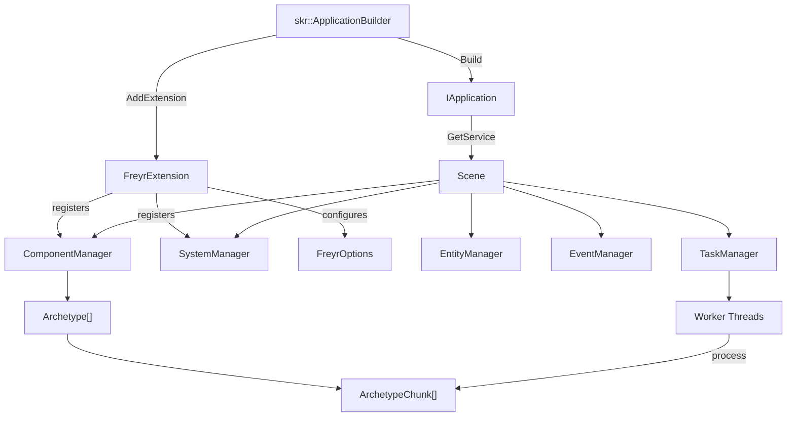
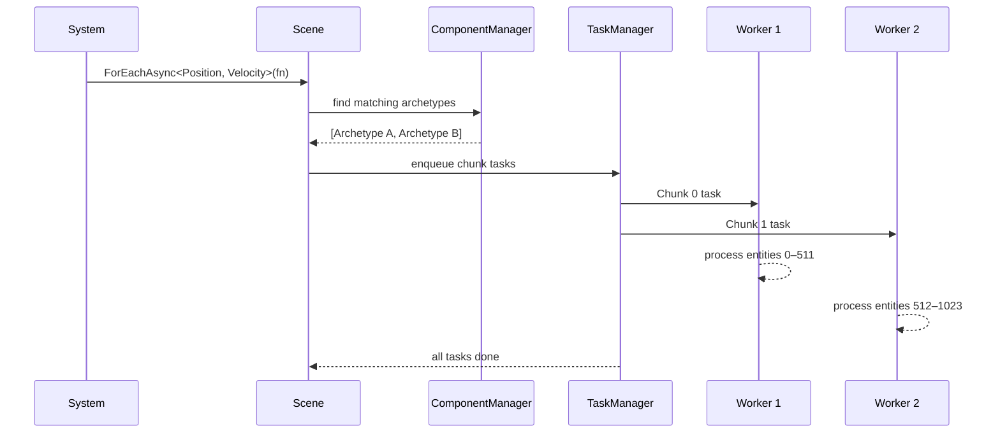

# Architecture

## High-level overview



---

## Core components

### Scene

The central orchestrator. All entity and component operations flow through `Scene`, which delegates to the appropriate manager.

```
Scene::Update(dt)
├─ PreUpdate(dt) → all systems across all pipelines
├ ├─ ExecuteTasks() → flush async tasks
├ └─ DestroyEntities() → process deferred destruction queue
├─ Update(dt)   → all systems across all pipelines  (ForEach / ForEachAsync live here)
├ ├─ ExecuteTasks() → flush async tasks
├ └─ DestroyEntities() → process deferred destruction queue
└─ PostUpdate(dt) → all systems across all pipelines
  ├─ ExecuteTasks() → flush async tasks
  └─ DestroyEntities() → process deferred destruction queue
```

### ComponentManager

Manages archetype discovery and entity placement. When an entity's component set changes, `ComponentManager` moves it to the correct archetype, migrating its data in place.

### EntityManager

Allocates and recycles entity IDs. Uses a free-list internally so destroyed entity slots are reused immediately.

### SystemManager

Holds all registered system instances. Calls lifecycle hooks in registration order.

### EventManager

Thread-safe publish/subscribe bus. Each event type gets its own `Publisher<T>`, backed by a shared-read/exclusive-write mutex and a pending-listener queue for safe concurrent subscription.

### TaskManager

A fixed-size thread pool with one **MPMC (multi-producer, multi-consumer) lock-free queue** per worker. Tasks (chunk iterations) are distributed either in dispatch order or by chunk affinity, depending on the configured `FreyrExecutionStategy`.

---

## Memory layout

```
Archetype [Position, Velocity]
│
├── ArchetypeChunk (capacity = 512 entities)
│   ├── ComponentArray<Position>   [p0, p1, p2, ..., p511]  ← contiguous
│   └── ComponentArray<Velocity>   [v0, v1, v2, ..., v511]  ← contiguous
│
└── ArchetypeChunk (capacity = 512 entities)
    ├── ComponentArray<Position>   [p512, ..., p1023]
    └── ComponentArray<Velocity>   [v512, ..., v1023]
```

Each `ComponentArray<T>` is a raw contiguous buffer of `T` values. A chunk owns one array per registered component type. When a system iterates `ForEach<Position, Velocity>`, it strides through both arrays simultaneously — all data remains in cache.

---

## Execution flow for `ForEachAsync`



---

## Execution strategies

| Strategy | Behaviour | Best for |
|----------|-----------|----------|
| `ChunkAffinity` | Each chunk is preferentially assigned to the same worker thread across frames | Systems that access the same chunks repeatedly — maximises L1/L2 reuse |
| `DispatchOrder` | Chunks are enqueued to workers in creation order | Predictable ordering, simpler debugging |

Configure via [`FreyrOptionsBuilder::WithExecutionStrategy`](../api/options-builder.md).
