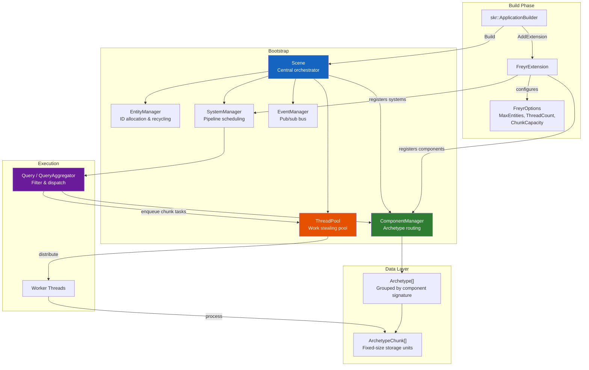
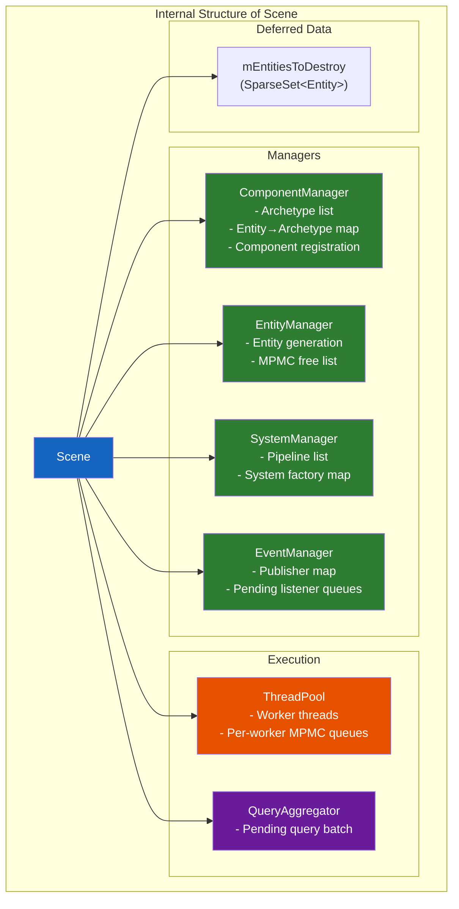
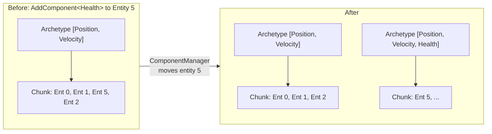
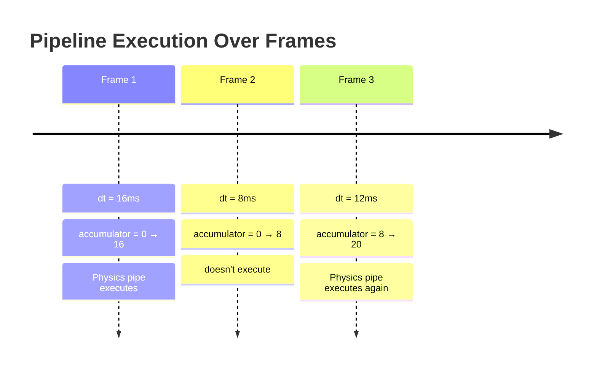
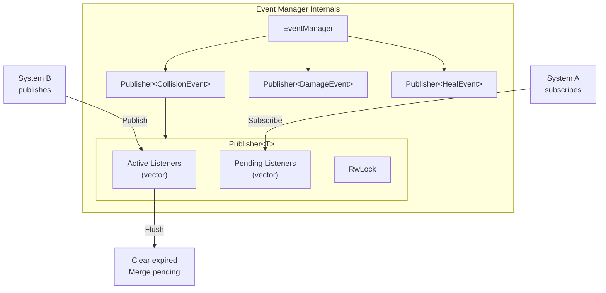

# Architecture

## High-level overview



---

## Scene — the central orchestrator

`Scene` owns all managers and drives the update loop. All entity and component operations flow through `Scene`,
which delegates to the appropriate manager.



### Update loop in detail

```
Scene::Update(dt)
│
├─ 1. EventManager::Flush()
│      Merge pending subscribers into active lists
│      Clear expired listener handles
│
├─ 2. ThreadPool::StartWorkers()
│      Signal workers to begin pulling tasks
│
├─ 3. SystemManager::Accumulate(dt)
│      For each Pipeline:
│        accumulator += dt
│        if accumulator >= rate_interval → mark pipeline ready
│
├─ 4. SystemManager::PreUpdate(dt)
│      For each ready pipeline:
│        For each system in pipeline:
│          system->PreUpdate(dt)
│      ThreadPool::WaitForAllTasks()
│      Scene::DestroyEntities()
│
├─ 5. SystemManager::Update(dt)          ← Main work happens here
│      For each ready pipeline:
│        For each system in pipeline:
│          system->Update(dt)  ← systems call Query::Each/EachAsync
│      ThreadPool::WaitForAllTasks()
│      Scene::DestroyEntities()
│
└─ 6. SystemManager::PostUpdate(dt)
       For each ready pipeline:
         For each system in pipeline:
           system->PostUpdate(dt)
       ThreadPool::WaitForAllTasks()
       Scene::DestroyEntities()
```

---

## ComponentManager — archetype routing

The `ComponentManager` maintains:

- A **flat list of `Archetype`** shared pointers
- A **`std::vector<EntityIndex>`** mapping each entity ID to its current `(Archetype*, ArchetypeChunk*)`

When a component is added or removed, `ComponentManager`:

1. Computes the new component signature
2. Searches existing archetypes for a matching signature
3. If found → migrate entity to existing archetype
4. If not found → create new archetype, extend the archetype list
5. Returns the new `(archetype, chunk)` pair

### Archetype migration



!!! note "Data is copied, not moved"
    During migration, component data is **copied** from the source chunk to the target chunk using
    `ComponentArray<T>::CopyComponent`. Components should be cheap to copy (prefer POD types).

---

## EntityManager — ID allocation

The `EntityManager` uses:

- A **`rigtorp::MPMCQueue<Entity>`** (lock-free multi-producer/multi-consumer queue) for recycled IDs
- An **`std::atomic<Entity>`** counter for new entity generation

When `CreateEntity()` is called:

1. Try to pop from the free list (MPMC queue) → fast path for recycled IDs
2. If empty, atomically increment the living count → new sequential ID

When `DestroyEntity()` is called:

1. Push the ID back onto the free list for immediate reuse

```cpp
Entity CreateEntity() {
    if (Entity entity; mAvailableEntities.try_pop(entity))
        return entity;                // recycled ID
    return mLivingEntityCount++;      // new ID
}

void DestroyEntity(Entity entity) {
    mAvailableEntities.try_push(entity);  // return to pool
}
```

---

## SystemManager — pipeline scheduling

The `SystemManager` holds:

- A **`std::vector<Pipeline>`** — each pipeline has a name, rate, accumulator, and list of system IDs
- A **`SparseSet<SystemId>`** of registered systems
- A **`std::vector<skr::ServiceFactory>`** — factory functions for lazy system construction

### Pipeline timing

```cpp
struct Pipeline {
    std::string_view Name;
    float            Rate;           // update interval in seconds
    float            Accumulator;    // elapsed time since last execution
    std::vector<SystemId> Systems;
};
```

Pipelines track their own elapsed time. A pipeline with `WithRate(60.0f)` has `Rate = 1/60 ≈ 0.0167s`.
The accumulator is incremented each frame by `dt`. When `accumulator >= Rate`, the pipeline executes.



---

## EventManager — pub/sub bus

The `EventManager` is fully thread-safe:

- **`Publisher<T>`** instances per event type, indexed by `EventId`
- **Pending listener queue** — subscribers added during `Publish()` are queued and merged before the next flush
- **Expired handle cleanup** — listeners with destroyed handles are removed during `Flush()`



---

## ThreadPool — work stealing

The `ThreadPool` uses:

- **One `rigtorp::MPMCQueue<Task>` per worker** — MPMC queues allow any thread to push, any thread to pop
- **Work stealing via LCG hashing** — `AddTask` distributes tasks across queues using a linear congruential generator
- **`TaskCounter`** — atomic counter tracking pending tasks for synchronisation

```cpp
void AddTask(auto&& func) {
    mTaskCounter->AddTasks(1);
    mQueueLcgState = mQueueLcgState * LCG_MULTIPLIER + LCG_INCREMENT;
    const auto nextQueue = mQueueLcgState % mWorkerQueues.size();
    mWorkerQueues[nextQueue]->push(std::forward<decltype(func)>(func));
}
```

When a worker finishes its queue, it tries to pop from other workers' queues — this is work stealing.

---

## Key design decisions

| Decision | Rationale |
|----------|-----------|
| Archetype-based storage | Maximises cache locality — entities with same components are stored together |
| Fixed-size chunks | Enables uniform task granularity for parallel dispatch |
| Per-worker MPMC queues | Minimises contention — producers hash to different queues |
| Deferred entity destruction | Prevents iterator invalidation during iteration |
| RwLock on archetypes | Allows concurrent reads (multiple queries) with exclusive writes (migration) |
| Skirnir DI integration | Systems can inject any dependency via constructor |
