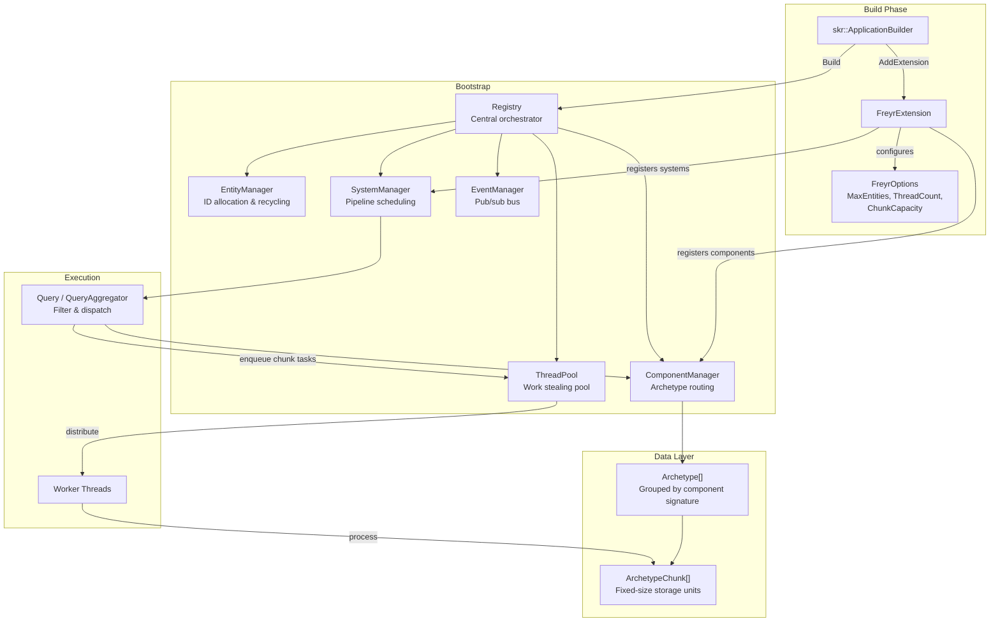
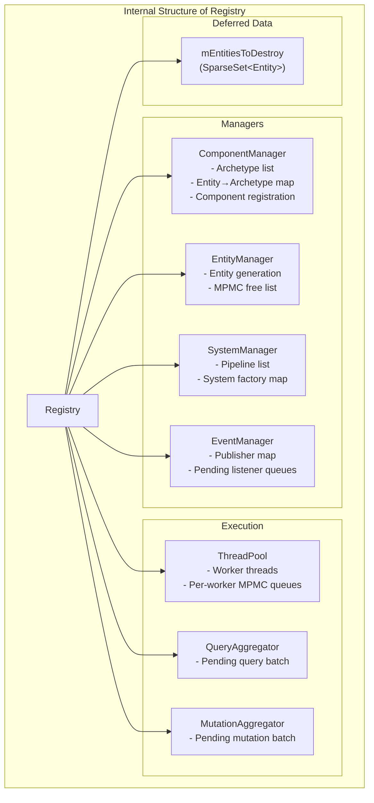
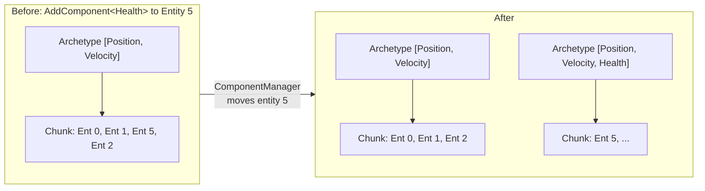
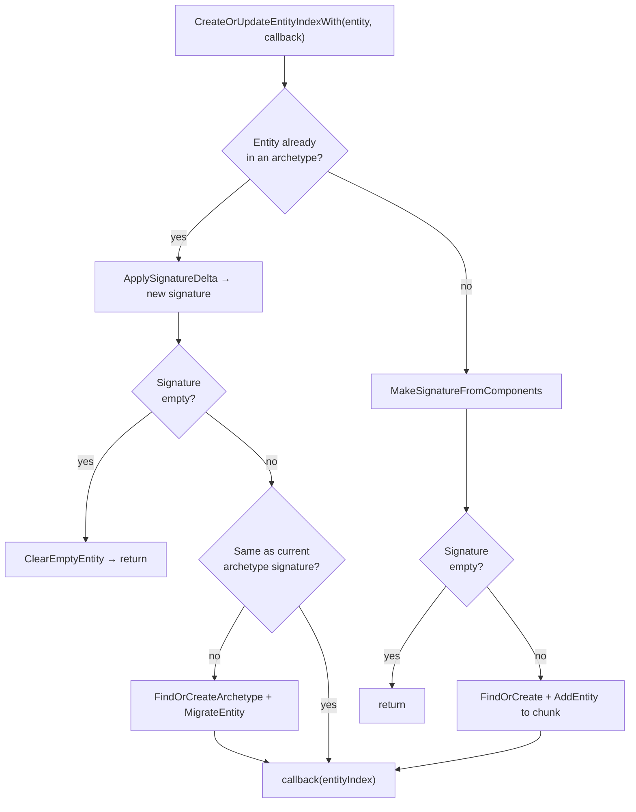
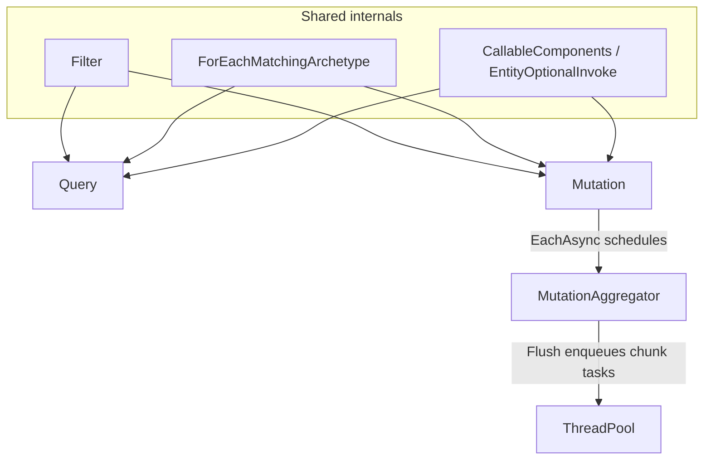
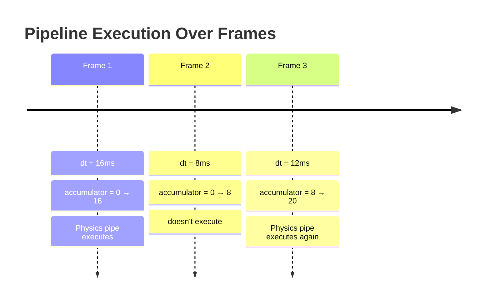
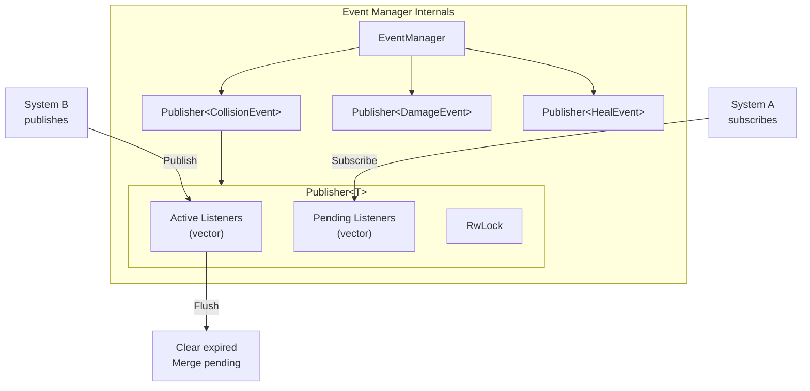

# Architecture

## High-level overview



---

## Registry — the central orchestrator

`Registry` owns all managers and drives the update loop. All entity and component operations flow through `Registry`,
which delegates to the appropriate manager.



### Update loop in detail

```
Registry::Update(dt)
│
├─ 1. EventManager::Flush()
│      Merge pending subscribers into active lists
│      Clear expired listener handles
│
├─ 2. ThreadPool::StartWorkers()
│      Signal workers to begin pulling tasks
│
├─ 3. SystemManager::Accumulate(dt)
│      For each Pipeline:
│        accumulator += dt
│        if accumulator >= rate_interval → mark pipeline ready
│
├─ 4. SystemManager::PreUpdate(dt)
│      For each ready pipeline:
│        For each system in pipeline:
│          system->PreUpdate(dt)
│      ThreadPool::WaitForAllTasks()
│      Registry::DestroyEntities()
│
├─ 5. SystemManager::Update(dt)          ← Main work happens here
│      For each ready pipeline:
│        For each system in pipeline:
│          system->Update(dt)  ← systems call Mutation::Each/EachAsync
│      ThreadPool::WaitForAllTasks()
│      Registry::DestroyEntities()
│
└─ 6. SystemManager::PostUpdate(dt)
       For each ready pipeline:
         For each system in pipeline:
           system->PostUpdate(dt)
       ThreadPool::WaitForAllTasks()
       Registry::DestroyEntities()
```

---

## ComponentManager — archetype routing

The `ComponentManager` maintains:

- A **flat list of `Archetype`** shared pointers
- A **`std::vector<EntityIndex>`** mapping each entity ID to its current `(Archetype*, ArchetypeChunk*)`

When a component is added or removed, `ComponentManager`:

1. Computes the new component signature
2. Searches existing archetypes for a matching signature
3. If found → migrate entity to existing archetype
4. If not found → create new archetype, extend the archetype list
5. Returns the new `(archetype, chunk)` pair

### Archetype migration



!!! note "Data is copied, not moved"
    During migration, component data is **copied** from the source chunk to the target chunk using
    `ComponentArray<T>::CopyComponent`. Components should be cheap to copy (prefer POD types).

### Entity migration flow (internal)

All structural changes (`AddComponent`, `RemoveComponent`, `AddComponents`, …) converge on
`ComponentManager::CreateOrUpdateEntityIndexWith`. The method holds a write lock on the entity-index
table and delegates to small helpers:

| Helper | Role |
|--------|------|
| `ApplySignatureDelta<Ts...>` | Apply add/remove tags to a working `Signature` |
| `MakeSignatureFromComponents<Ts...>` | Build a signature for a new (previously empty) entity |
| `FindOrCreateArchetype<Ts...>` | Lookup in `mArchetypesBySignature`; register components on miss |
| `MigrateEntity` | Reserve slot in target chunk, enqueue `MoveData` + callback on source chunk |
| `ClearEmptyEntity` | Signature became empty → enqueue remove, null out index |



**Deferred work:** when migration is required, the entity index is updated immediately (new
`(archetype, chunk)` pair), but component data moves on the **source chunk's task queue**. The
optional callback runs after `MoveData` completes. Callers must `Registry::ExecuteTasks()` (or wait
for the update phase) before reading migrated components.

**Order preservation:** multiple pending mutations on the same chunk are fused in schedule order
(see [MutationAggregator](#mutationaggregator-deferred-structural-changes) below).

---

## Query vs Mutation

Both `Query` and `Mutation` are fluent, filter-driven APIs over `ComponentManager`. They share:

- **`Filter`** — include/exclude component signatures (`All<Ts...>()`, `Excluding<Ts...>()`)
- **`ForEachMatchingArchetype`** — scan archetypes that match the filter
- **`meta::components_tuple_t`** — deduce component types from a lambda (see [CallableComponents](#callablecomponents-signature-deduction))
- **`meta::callback_takes_entity_v`** — optional leading `Entity` parameter in callbacks



| | **Query** | **Mutation** |
|---|-----------|----------------|
| **Purpose** | Read / collect matching entities | Write / transform components in place |
| **When it runs** | Immediately on the calling thread | `Each` sync now; `EachAsync` deferred until `ExecuteTasks` / update phase |
| **Terminal ops** | `Count`, `Map`, `Transform`, `Reduce`, `First`, … | `Each`, `EachAsync` |
| **Side effects** | None (const iteration) | Mutates component storage |
| **Parallelism** | Single-threaded scan | `EachAsync` dispatches per-chunk tasks via `MutationAggregator` |
| **Typical use** | UI picking, debug overlays, one-off lookups | Systems that modify component data each frame |

**Rule of thumb:** use `Query` when you need answers or snapshots; use `Mutation` (usually
`EachAsync` inside systems) when you need to change world state. Avoid storing `Query`/`Mutation`
instances — create them from `Registry::CreateQuery()` / `CreateMutation()` at point of use.

### MutationAggregator — deferred structural changes

`Mutation::EachAsync` does **not** run immediately. It appends a `PendingMutation` to
`MutationAggregator`, indexed by include signature at schedule time. On `Flush()` (called from
`Registry::ExecuteTasks`):

1. For each archetype, collect matching pending mutations (sorted by schedule index)
2. Enqueue one task per chunk
3. If multiple mutations match the same chunk, fuse them into a **single pass** over entities
4. `StartTasks` + `WaitForAllTasks` drain the thread pool

Implementation lives in [`MutationAggregator.cpp`](../../src/Core/MutationAggregator.cpp):
`CollectMatchingMutationIndexes`, `RunSingleMutation`, `RunBatchedMutations`.

---

## CallableComponents — signature deduction

Query and Mutation infer which components a lambda needs at **compile time** using C++26 reflection
([`CallableComponents.hpp`](../../include/Freyr/Meta/CallableComponents.hpp)).

Given a callable `F`, the pipeline is:

1. **`FindCallOperator`** — locate `operator()` on `std::decay_t<F>`
2. **`ConcreteCallOperator`** — reject generic lambdas (`auto` parameters); all types must be concrete
3. **`ComponentsTupleInfo`** — walk parameters left to right:
   - Skip an optional leading `Entity` (must be typed as `Entity`, not `auto`)
   - Collect every parameter whose type derives from `Component`
   - Produce `std::tuple<Ts...>` via spliced reflection `[:detail::ComponentsTupleInfo<F>():]`
4. **`components_tuple_t<F>`** — public alias consumed by `Query::Map(f)`, `Mutation::Each(f)`, etc.

```cpp
// Deduces PositionComponent + VelocityComponent; Entity is optional
registry->CreateQuery()->Reduce(
    0.f,
    [](float acc, PositionComponent& pos, VelocityComponent& vel) {
        return acc + pos.x * vel.x;
    });

// Leading Entity must be explicit when needed
registry->CreateMutation()->Each([](Entity e, Health& hp) { hp.value -= 1; });
```

**Entity-optional dispatch** ([`EntityOptionalInvoke.hpp`](../../include/Freyr/Meta/EntityOptionalInvoke.hpp))
centralises the `if constexpr` split:

- `callback_takes_entity_v<F, Ts...>` — is the callable invocable as `(Entity, Ts&...)`?
- `invoke_with_optional_entity` / `invoke_at_component_pointers` — used by `Query`, `Mutation`, and
  `ArchetypeChunk::ForEach`

!!! warning "Constraints"
    - Parameters must be **concrete** component references (`Health&`), not `auto`
    - Optional `Entity` must appear **first** if present
    - At least one component type is required
    - `Reduce` uses `components_tuple_after_first_t` — first parameter is the accumulator, rest are components

---

## EntityManager — ID allocation

The `EntityManager` uses:

- A **`rigtorp::MPMCQueue<Entity>`** (lock-free multi-producer/multi-consumer queue) for recycled IDs
- An **`std::atomic<Entity>`** counter for new entity generation

When `CreateEntity()` is called on `EntityManager`:

1. Try to pop from the free list (MPMC queue) → fast path for recycled IDs
2. If empty, atomically increment the living count → new sequential ID (`0 .. MaxEntities-1`)

When `Registry::DestroyEntity()` is called:

1. The entity is queued for deferred destruction (end of the update phase)
2. Component removal is enqueued on the entity's chunk task queue
3. After chunk tasks drain, the ID is pushed onto the free list for reuse

```cpp
Entity CreateEntity() {
    if (Entity entity; mAvailableEntities.try_pop(entity))
        return entity;                // recycled ID
    // living count is a high-water mark; valid IDs stay below MaxEntities
    return mLivingEntityCount++;
}

void DestroyEntity(Entity entity) {
    mAvailableEntities.try_push(entity);  // return to pool (after deferred destroy completes)
}
```

!!! note "Recycle timing"
    IDs are not recycled in the same instant `Registry::DestroyEntity` returns. Structural remove runs
    asynchronously on the chunk queue; the free-list push happens only after `WaitForAllTasks`, so a
    recycled ID cannot collide with an in-flight remove.

---

## SystemManager — pipeline scheduling

The `SystemManager` holds:

- A **`std::vector<Pipeline>`** — each pipeline has a name, rate, accumulator, and list of system IDs
- A **`SparseSet<SystemId>`** of registered systems
- A **`std::vector<skr::ServiceFactory>`** — factory functions for lazy system construction

### Pipeline timing

```cpp
struct Pipeline {
    std::string_view Name;
    float            Rate;           // update interval in seconds
    float            Accumulator;    // elapsed time since last execution
    std::vector<SystemId> Systems;
};
```

Pipelines track their own elapsed time. A pipeline with `WithRate(60.0f)` has `Rate = 1/60 ≈ 0.0167s`.
The accumulator is incremented each frame by `dt`. When `accumulator >= Rate`, the pipeline executes.



---

## EventManager — pub/sub bus

The `EventManager` is fully thread-safe:

- **`Publisher<T>`** instances per event type, indexed by `EventId`
- **Pending listener queue** — subscribers added during `Publish()` are queued and merged before the next flush
- **Expired handle cleanup** — listeners with destroyed handles are removed during `Flush()`



---

## ThreadPool — work stealing

The `ThreadPool` uses:

- **One `rigtorp::MPMCQueue<Task>` per worker** — MPMC queues allow any thread to push, any thread to pop
- **Work stealing via LCG hashing** — `AddTask` distributes tasks across queues using a linear congruential generator
- **`TaskCounter`** — atomic counter tracking pending tasks for synchronisation

```cpp
void AddTask(auto&& func) {
    mTaskCounter->AddTasks(1);
    mQueueLcgState = mQueueLcgState * LCG_MULTIPLIER + LCG_INCREMENT;
    const auto nextQueue = mQueueLcgState % mWorkerQueues.size();
    mWorkerQueues[nextQueue]->push(std::forward<decltype(func)>(func));
}
```

When a worker finishes its queue, it tries to pop from other workers' queues — this is work stealing.

---

## Key design decisions

| Decision | Rationale |
|----------|-----------|
| Archetype-based storage | Maximises cache locality — entities with same components are stored together |
| Fixed-size chunks | Enables uniform task granularity for parallel dispatch |
| Per-worker MPMC queues | Minimises contention — producers hash to different queues |
| Deferred entity destruction | Prevents iterator invalidation during iteration |
| RwLock on archetypes | Allows concurrent reads (multiple queries) with exclusive writes (migration) |
| Skirnir DI integration | Systems can inject any dependency via constructor |
