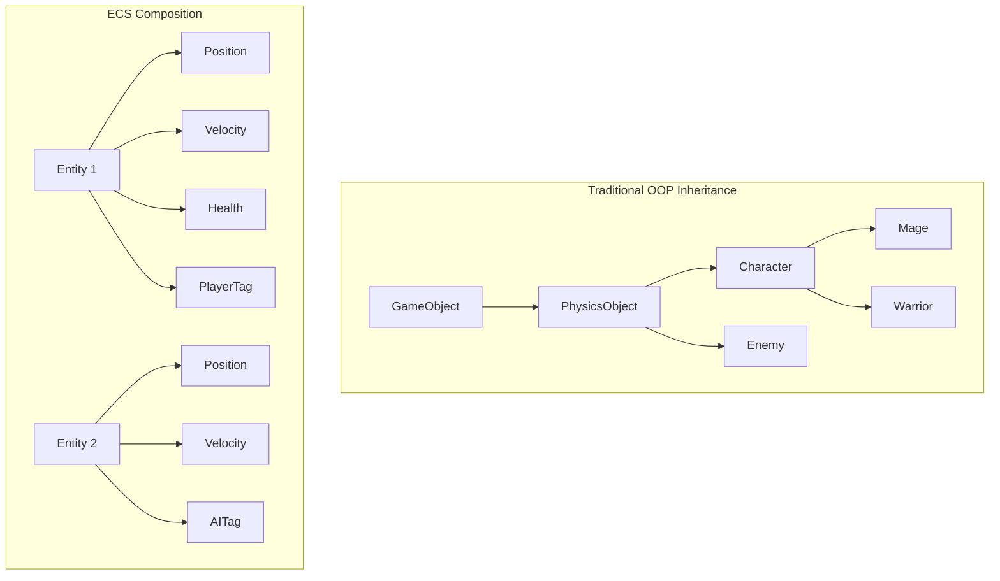
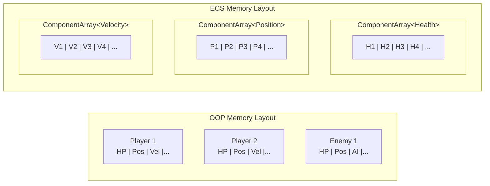

# ECS Overview

## What is ECS?

**Entity-Component-System (ECS)** is a software architectural pattern popular in real-time simulations and games.
It follows the principle of **composition over inheritance**: objects in the world are not defined by class hierarchies,
but by the data attached to them.

| Concept | Role |
|---------|------|
| **Entity** | A lightweight identifier (integer ID) representing a world object |
| **Component** | A plain data structure holding one aspect of an entity's state |
| **System** | Logic that processes all entities matching a specific set of components |

### Entities are not objects

In traditional OOP, a "Player" is an object with data and methods. In ECS, a "Player" is just an integer
with a `PlayerTag` component attached. The entity **is** the sum of its components — nothing more.

```cpp
// OOP: Entity is a class with state and behaviour
class Player : public GameObject {
    void Update(float dt) override;
    float hp, maxHp;
    float x, y;
};

// ECS: Entity is an ID, data lives in components
struct Health : fr::Component { float current, max; };
struct Position : fr::Component { float x, y; };

// Player = Entity 42 + Health + Position + PlayerTag
auto player = registry->CreateEntity(
    Health  { .current = 100, .max = 100 },
    Position { .x = 0, .y = 0 },
    PlayerTag {}
);
```

---

## Why ECS?

### Traditional OOP problems

In a typical game, a `Character` class might inherit from `PhysicsObject`, which inherits from `GameObject`.
Adding a new behaviour (e.g. swimming) requires modifying the hierarchy or adding awkward mixins.
Data and behaviour are tightly coupled, and related data is scattered across unrelated memory addresses.



### ECS advantages

**Data-Oriented Design**
: Components are stored contiguously in memory. When a system processes 1,000,000 positions, it reads a packed
array — no pointer chasing, maximum cache efficiency.

**Parallel-friendly**
: Systems that operate on different component sets have no shared state by default. They can run in parallel with
no synchronisation. Within a single system, individual entities have no dependencies, so chunk-level parallelism
is safe.

**Dynamic behaviour**
: Adding or removing a component at runtime changes which systems process that entity — without recompilation
or virtual dispatch.

```cpp
// An enemy becomes paralyzed — just remove its MovementTag
registry->RemoveComponent<MovementTag>(enemy);

// Now MovementSystem skips it automatically
// Query::Each<Position, Velocity, MovementTag> will not include it
```

---

## Cache performance comparison



When `MovementSystem` iterates all positions:

- **OOP**: Pointer chase from `GameObject*` → `Transform*` → `x, y` — each entity might be anywhere in memory
- **ECS**: Linear scan of `ComponentArray<Position>` — all positions are adjacent, entire array fits in cache

---

## Pros and cons

### Pros

- Contiguous data layout → fewer cache misses → higher throughput
- Natural fit for multi-core processing
- Entities change behaviour by gaining/losing components, not by subclassing
- Scales to millions of entities
- Systems are reusable across different entity types

### Cons

- Higher initial complexity than OOP
- Overkill for small numbers of unique, one-off objects
- Requires careful component design to avoid data duplication
- Can be harder to debug (no clear "object" to inspect)

---

## ECS in Freyr

Freyr extends the basic ECS model with **archetypes** — groups of entities that share the same set of component
types. All entities in an archetype are stored together in fixed-size **chunks**.

```text
Archetype [Position, Velocity]
├── Chunk 0   → entities 0–511
├── Chunk 1   → entities 512–1023
└── Chunk 2   → entities 1024–1535

Archetype [Position, Health]
└── Chunk 0   → entities 1536–2047
```

When you call `Query::EachAsync<Position, Velocity>`, Freyr:

1. Finds all archetypes whose signature contains `Position` and `Velocity`
2. Enqueues each matching chunk as an independent task
3. Worker threads pull and process chunks concurrently

This design means:
- **Cache locality** — all positions in a chunk are contiguous
- **Zero false sharing** — each chunk belongs to exactly one task at a time
- **Scalable** — more threads = more chunks processed in parallel

---

## Entity identity

An entity is an unsigned integer (`fr::Entity`, `uint32_t`). It has no data of its own — its identity is the
union of its components.

```cpp
using fr::Entity = std::uint32_t;
```

!!! warning "ID stability"
    An entity's internal ID *may* change when components are added or removed, as the entity migrates to a
    different archetype. Do not persist raw entity IDs across frames if the entity's component set changes,
    unless you use a stable mapping layer.

!!! tip "Entity recycling"
    Destroyed entity IDs are recycled via a lock-free MPMC queue. The next `CreateEntity` call reuses a freed
    slot immediately, keeping memory usage bounded by `MaxEntities`.


## When to use ECS

Freyr is ideal for:

- **Large-scale simulations**: 100k+ entities with shared behaviour
- **Games with many actor types**: different combinations of components define different behaviours
- **Data-heavy systems**: physics, particle systems, AI crowd simulation
- **Multi-core workloads**: automatic chunk-level parallelism

Freyr is **less** suited for:

- Simple applications with few unique objects
- UI-centric applications
- Situations where entities have wildly different update schedules
