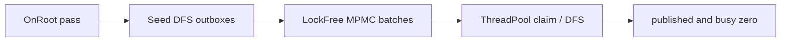

# Hierarchy

Freyr provides a **non-fragmenting** parent/child hierarchy. Topology lives in the ECS; hierarchical
propagation (transforms, layout, bones, …) is **policy-driven** and component-agnostic.

---

## Topology

| Piece | Role |
|-------|------|
| `ChildOf` | Exclusive parent link on the child (`NullEntity` = root / detached) |
| `ParentDepth` | Depth from root (updated on reparent) |
| `HierarchyManager` | Ordered children side-table + depth buckets (outside components) |

Bootstrap:

```cpp
freyr.WithHierarchy(); // registers ChildOf + ParentDepth
```

API on `Registry`:

```cpp
registry->SetParent(child, parent);
registry->ClearParent(child);
auto parent = registry->GetParent(child); // NullEntity if none
registry->ForEachChild(parent, [](fr::Entity child) { /* ... */ });
registry->MarkHierarchyDirty<MyLocal>(entity);
```

`SetParent` / `ClearParent` update the side-table and depth immediately. `ChildOf` /
`ParentDepth` components flush in batch on `ExecuteTasks()` / `Update()` (or
`FlushHierarchyComponents()`).

### Cascade destroy

`DestroyEntity(parent)` expands to all descendants (depth-last) before the normal deferred destroy
flush. Hierarchy links are cleared in the same pass.

---

## Agnostic propagation

The **Local** side of a policy must inherit `HierarchyLocal` (carries `bool isDirty`). `World` is a
normal `Component`.

```cpp
struct PositionComponent : fr::HierarchyLocal
{
    float x = 0.f;
    float y = 0.f;
};

struct WorldPosition : fr::Component
{
    float x = 0.f;
    float y = 0.f;
};

struct PositionPolicy {
    using Local = PositionComponent;
    using World = WorldPosition;

    void OnRoot(fr::ComponentManager& cm, fr::Entity root) const;
    void Propagate(fr::ComponentManager& cm, fr::Entity parent, fr::Entity child) const;
    bool HasChildrenInterest(fr::ComponentManager& cm, fr::Entity entity) const;
};
```

Register:

```cpp
freyr.WithHierarchyPropagation<PositionPolicy>();
```

This registers `Local`/`World`, hierarchy components, and
`HierarchyPropagationSystem<Policy>` on a dedicated pipeline.

### Built-in example policies

| Header | Use case |
|--------|----------|
| `Freyr/Hierarchy/Policies/Mat4TransformPolicy.hpp` | 3D `LocalTransform3D` / `WorldTransform3D` (mat4) |
| `Freyr/Hierarchy/Policies/Affine2DTransformPolicy.hpp` | 2D TRS → affine world |

```cpp
#include <Freyr/Hierarchy/Policies/Mat4TransformPolicy.hpp>

freyr.WithHierarchyPropagation<fr::Mat4TransformPolicy>();
```

---

## Parallel scheduler

Default mode is **Bevy-style work-sharing DFS** (`HierarchyPropagationMode::WorkSharing`):

1. **Pass A** — `OnRoot` for root entities (skipped when dirty-only and not dirty)
2. **Pass B** — seed roots into a lock-free `HierarchyWorkQueue` (MPMC); Freyr `ThreadPool`
   workers claim batches, DFS descendants with a thread-local outbox (flush at 512), continue
   locally on the last child
3. Termination when `published == 0` **and** `busy == 0` (`published++` before push; `busy++` on
   successful claim; `SendBatches` before `FinishBatch`)

Fallback: `HierarchyPropagationMode::LevelSync` — barrier per `ParentDepth`, parallel grains of 512
via the same `ThreadPool`.

```cpp
registry->GetHierarchyManager()->SetPropagationMode(fr::HierarchyPropagationMode::LevelSync);
```

Workers are pooled (`ThreadPool::AddTask` / `WaitForAllTasks`) — no per-frame `std::thread`
spawn/join. The shared queue has no mutex (rigtorp unbounded MPMC).



### Dirty trees

`HierarchyLocal::isDirty` is the source of truth. After mutating a Local:

```cpp
local.x += 1.f;
registry->MarkHierarchyDirty<PositionComponent>(entity);
```

`MarkHierarchyDirty` sets `isDirty` on the entity, its descendants, and ancestors. When any dirty
flags are set (`HasAnyDirty`), propagation only visits dirty Locals, then clears `isDirty`. With no
marks, the full forest updates (static scenes). Clean sibling branches are skipped — only the dirty
subtree recalculates World values.

---

## Benchmarks

```bash
cmake --build [build_dir] --target HierarchyTransformBench
./[build_dir]/benchmarks/HierarchyTransform/HierarchyTransformBench \
  --benchmark_filter=Propagate_ThreadScale --benchmark_repetitions=5
```

| Topology | ~entities | branching | depth cap |
|----------|-----------|-----------|-----------|
| Wide | 4 000 | 16 | 3 |
| Deep | 2 000 | 2 | 20 |
| Large | 12 000 | 4 | 8 |
| Huge | 50 000 | 4 | 12 |
| Massive | 100 000 | 4 | 14 |

`BM_Propagate_ThreadScale/{topology}/{threads}/{mode}` labels include entity count. Mode: `0=LevelSync`,
`1=WorkSharing`. Suites also cover `SetParent`, children iteration, cascade destroy, and
static/animated propagation.
