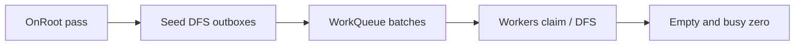

# Hierarchy

Freyr provides a **non-fragmenting** parent/child hierarchy. Topology lives in the ECS; hierarchical
propagation (transforms, layout, bones, …) is **policy-driven** and component-agnostic.

---

## Topology

| Piece | Role |
|-------|------|
| `ChildOf` | Exclusive parent link on the child (`NullEntity` = root / detached) |
| `ParentDepth` | Depth from root (updated on reparent) |
| `HierarchyManager` | Ordered children side-table + depth buckets (outside components) |

Bootstrap:

```cpp
freyr.WithHierarchy(); // registers ChildOf + ParentDepth
```

API on `Registry`:

```cpp
registry->SetParent(child, parent);
registry->ClearParent(child);
auto parent = registry->GetParent(child); // NullEntity if none
registry->ForEachChild(parent, [](fr::Entity child) { /* ... */ });
registry->MarkHierarchyDirty(entity); // optional dirty-tree opt-in
```

`SetParent` / `ClearParent` update the side-table and depth immediately. `ChildOf` /
`ParentDepth` components flush in batch on `ExecuteTasks()` / `Update()` (or
`FlushHierarchyComponents()`).

### Cascade destroy

`DestroyEntity(parent)` expands to all descendants (depth-last) before the normal deferred destroy
flush. Hierarchy links are cleared in the same pass.

---

## Agnostic propagation

The core never assumes a transform type. You implement a **policy**:

```cpp
struct MyPolicy {
    using Local = MyLocal;   // fr::Component
    using World = MyWorld;   // fr::Component

    void OnRoot(fr::ComponentManager& cm, fr::Entity root) const;
    void Propagate(fr::ComponentManager& cm, fr::Entity parent, fr::Entity child) const;
    bool HasChildrenInterest(fr::ComponentManager& cm, fr::Entity entity) const;
};
```

Register:

```cpp
freyr.WithHierarchyPropagation<MyPolicy>();
```

This registers `Local`/`World`, hierarchy components, and
`HierarchyPropagationSystem<MyPolicy>` on a dedicated pipeline.

### Built-in example policies

| Header | Use case |
|--------|----------|
| `Freyr/Hierarchy/Policies/Mat4TransformPolicy.hpp` | 3D `LocalTransform3D` / `WorldTransform3D` (mat4) |
| `Freyr/Hierarchy/Policies/Affine2DTransformPolicy.hpp` | 2D TRS → affine world |

```cpp
#include <Freyr/Hierarchy/Policies/Mat4TransformPolicy.hpp>

freyr.WithHierarchyPropagation<fr::Mat4TransformPolicy>();
```

---

## Parallel scheduler

Default mode is **Bevy-style work-sharing DFS** (`HierarchyPropagationMode::WorkSharing`):

1. **Pass A** — `OnRoot` for root entities (skipped when dirty-only and not dirty)
2. **Pass B** — seed roots into a shared `HierarchyWorkQueue`; workers claim batches, DFS
   descendants with a thread-local outbox (flush at 512), continue locally on the last child
3. Termination when the queue is empty **and** `busy == 0` (busy incremented under the claim lock;
   `SendBatches` before `FinishBatch`)

Fallback: `HierarchyPropagationMode::LevelSync` — barrier per `ParentDepth`, parallel grains of 512.

```cpp
registry->GetHierarchyManager()->SetPropagationMode(fr::HierarchyPropagationMode::LevelSync);
```

Workers use scoped `std::thread` (not Freyr `ThreadPool`) to avoid pool deadlock if the protocol
fails.



### Dirty trees

`MarkHierarchyDirty(entity)` marks the entity, its descendants, and ancestors. When any dirty bits
are set, propagation only visits dirty nodes, then clears the bitset. With no marks, the full
forest updates (static scenes).

---

## Benchmarks

```bash
cmake --build [build_dir] --target HierarchyTransformBench
./[build_dir]/benchmarks/HierarchyTransform/HierarchyTransformBench \
  --benchmark_filter=Propagate --benchmark_repetitions=5
```

Suites cover `SetParent`, children iteration, cascade destroy, static/animated propagation, and
WorkSharing vs LevelSync on wide / deep / large trees (seed-fixed).
