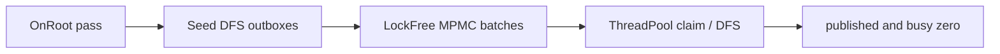

# Hierarchy

Freyr provides a **non-fragmenting** parent/child hierarchy. Topology lives in the ECS; hierarchical
propagation (transforms, layout, bones, …) is **policy-driven** and component-agnostic.

---

## Topology

| Piece | Role |
|-------|------|
| `ChildOf` | Exclusive parent link on the child (`EntityHandle`; `NullHandle` = root / detached) |
| `ParentDepth` | Depth from root (updated on reparent) |
| `HierarchyManager` | Per-entity node side-table (parent + intrusive ordered sibling list, depth, dirty/sync state) + depth buckets (outside components) |

Children are an intrusive doubly linked list (`first`/`last` on the parent, `prev`/`next` on each child,
as in EnTT's `relationship`): attach, detach and reparent are O(1), keep insertion order and never
allocate. `Children(parent)` returns a forward range (`begin`/`end`/`empty`/`front`, `size()` is
O(children)). Node storage is selected with `FreyrOptionsBuilder::WithHierarchyStorage`: `Sparse`
(paged sparse set, memory proportional to hierarchy size, the default) or `Dense` (indexed by
entity, fastest traversal, memory sized by `MaxEntities`).

Bootstrap:

```cpp
freyr.WithHierarchy(); // registers ChildOf + ParentDepth
```

API on `Registry`:

```cpp
registry->SetParent(child, parent);   // false on cycle, self-parent, or out-of-range id
registry->ClearParent(child);
registry->SetParent(child, fr::NullEntity); // equivalent to ClearParent
auto parent = registry->GetParent(child); // NullEntity if none
registry->ForEachChild(parent, [](fr::Entity child) { /* ... */ });
registry->MarkHierarchyDirty<MyLocal>(entity);
```

`SetParent` / `ClearParent` update the side-table and depth immediately. `ChildOf` /
`ParentDepth` components flush in batch on `ExecuteTasks()` / `Update()` (or
`FlushHierarchyComponents()`).

### Query helpers

All helpers below are O(depth) unless noted otherwise; they work correctly before and after
`FlushHierarchyComponents()`.

| Signature | Description |
|---|---|
| `ForEachRoot(cb)` | Calls `cb(entity)` for every entity in the hierarchy with no parent (insertion order unspecified). O(roots). |
| `IsAncestorOf(ancestor, entity)` | True if `ancestor` is a proper ancestor of `entity` (does not include `entity` itself). Returns false when either argument is `NullEntity`. |
| `IsDescendantOf(entity, ancestor)` | Symmetric alias: `IsDescendantOf(e, a) == IsAncestorOf(a, e)`. |
| `FindAncestorWith<T>(entity)` | Walks the parent chain from `GetParent(entity)` upward; returns the first ancestor that has component `T`, or `NullEntity`. Does **not** check `entity` itself. |
| `ForEachDescendant(root, pred, cb)` | Pre-order traversal; if `pred(entity)` returns false the entity **and its entire subtree** are skipped. |
| `ForEachDescendantWithParent(root, cb)` | Pre-order; `cb(child, parent)` where `parent` is the direct parent of `child`. Does not call `GetParent` internally — threads parent through the DFS stack. Parent is always visited before its children. |
| `MoveSiblingBefore(entity, anchor)` | Moves `entity` to appear immediately before `anchor` in the sibling list. Both must share the same parent. O(1) for the list manipulation. No-op if `entity == anchor` or entity has no parent. |
| `MoveSiblingToIndex(entity, idx)` | Moves `entity` to position `idx` in the parent's child list (0 = first). O(siblings) to walk to the insertion point. |

`ForEachDescendant(root, cb)` (the single-callback overload) guarantees **pre-order** traversal:
every parent is visited before any of its children.

Change detection on the synced components:

| Operation | `ChildOf` | `ParentDepth` |
|---|---|---|
| First `SetParent` | `Added` + `ObserveAdd` | `Added` (if missing) or `Changed` |
| Reparent | `Changed` (no `ObserveAdd`); untouched if the parent handle is the same | `Changed` only if the depth changed |
| `ClearParent` | removed (`Removed` + `ObserveRemove`) | `Changed` only if the depth changed |
| Descendants of a moved entity | untouched | `Changed` only if their depth changed |

Use `Changed<ChildOf>` to detect reparenting; `Added<ChildOf>` only fires when an entity gains its
first parent.

### Cascade destroy

`DestroyEntity(parent)` expands to all descendants (depth-last) before the normal deferred destroy
flush. Hierarchy links are cleared in the same pass.

---

## Agnostic propagation

The **Local** side of a policy must inherit `HierarchyLocal` (carries `bool isDirty`). `World` is a
normal `Component`.

```cpp
struct PositionComponent : fr::HierarchyLocal
{
    float x = 0.f;
    float y = 0.f;
};

struct WorldPosition : fr::Component
{
    float x = 0.f;
    float y = 0.f;
};

struct PositionPolicy {
    using Local = PositionComponent;
    using World = WorldPosition;

    void OnRoot(fr::ComponentManager& cm, fr::Entity root) const;
    void Propagate(fr::ComponentManager& cm, fr::Entity parent, fr::Entity child) const;
    bool HasChildrenInterest(fr::ComponentManager& cm, fr::Entity entity) const;
};
```

Register:

```cpp
freyr.WithHierarchyPropagation<PositionPolicy>();
```

This registers `Local`/`World`, hierarchy components, and
`HierarchyPropagationSystem<Policy>` on a dedicated pipeline. The system does its work in
`PostUpdate`: with no dirty marks it recomputes the full forest, otherwise only dirty subtrees.

### Built-in example policies

| Header | Use case |
|--------|----------|
| `Freyr/Hierarchy/Policies/Mat4TransformPolicy.hpp` | 3D `LocalTransform3D` / `WorldTransform3D` (mat4) |
| `Freyr/Hierarchy/Policies/Affine2DTransformPolicy.hpp` | 2D TRS → affine world |

```cpp
#include <Freyr/Hierarchy/Policies/Mat4TransformPolicy.hpp>

freyr.WithHierarchyPropagation<fr::Mat4TransformPolicy>();
```

`Freyr/Hierarchy/Policies/Transform3DPolicy.hpp` covers the common game-engine layout: an editable
`Transform3D` (position, quaternion `x,y,z,w`, scale) propagated into a `WorldTransform3D` mat4. It also
ships the helpers needed for world-space writes (physics write-back, reparent keeping world pose):

```cpp
float target[16];
fr::ComposeMatrix(worldPose, target);
local = fr::LocalFromWorld(parentWorld.matrix, target); // inverse(parentWorld) * target, decomposed
registry->MarkHierarchyDirty<fr::Transform3D>(entity);
```

---

## Parallel scheduler

Default mode is **Bevy-style work-sharing DFS** (`HierarchyPropagationMode::WorkSharing`):

1. **Pass A** — `OnRoot` for root entities (via a sync `Mutation::Each` over `Local` + `World`)
2. **Pass B** — seed roots with children (`HierarchyManager::RootsWithChildren()`, maintained by
   `SetParent` / `ClearParent` / destroy, never rebuilt by scanning) into a lock-free `HierarchyWorkQueue`
   (unbounded MPMC of `Batch` vectors, `ChunkSize = 64`); one level of descendants is propagated
   inline while seeding, the rest is claimed in batches by `ThreadPool` workers (plus the calling
   thread), each walking its batch depth-first with a thread-local outbox flushed every 64
   entities and continuing down the last branch locally
3. Termination when `published == 0` **and** `busy == 0` (`published++` before push;
   `busy++` on successful claim, `FinishBatch` after `SendBatches`)

Fallback: `HierarchyPropagationMode::LevelSync` — barrier per depth bucket (rebuilt from
`RootsWithChildren` descendants when dirty), parallel grains of 64 via the same `ThreadPool`
(single-threaded fast path when only one worker or few entities).

```cpp
registry->GetHierarchyManager()->SetPropagationMode(fr::HierarchyPropagationMode::LevelSync);
```

Workers are pooled (`ThreadPool::AddTask` / `WaitForAllTasks`) — no per-frame `std::thread`
spawn/join. The shared queue has no mutex (rigtorp unbounded MPMC).


```mermaid
flowchart LR
  roots[OnRoot pass] --> seed[Seed DFS outboxes]
  seed --> q[LockFree MPMC batches]
  q --> workers[ThreadPool claim / DFS]
  workers --> done[published and busy zero]
```

### Dirty trees

After mutating a Local, mark the entity:

```cpp
local.x += 1.f;
registry->MarkHierarchyDirty<PositionComponent>(entity);
```

`MarkHierarchyDirty` is O(1): it records the entity in a dirty queue, sets a flag in the
`HierarchyManager` side-table and mirrors it to `HierarchyLocal::isDirty`. Descendants and ancestors
are not touched.

When anything is marked (`HasAnyDirty`), a frame costs proportional to the dirty set:

1. The dirty queue is reduced to **heads** — marked entities with no marked ancestor.
2. Each head gets `OnRoot` (roots) or `Propagate` from its (clean, already up-to-date) parent.
3. The whole subtree under each head is recomputed once (work-sharing DFS, or a per-level
   frontier in `LevelSync` mode). Nested marks inside a head's subtree are not visited twice.
4. Dirty flags are cleared.

Clean roots, clean siblings and ancestors of a marked entity are never visited. With no marks, the
full forest updates (static scenes / code that never calls `MarkHierarchyDirty`).

---

## Benchmarks

```bash
cmake --build [build_dir] --target HierarchyTransform
./[build_dir]/benchmarks/HierarchyTransform/HierarchyTransform \
  --benchmark_filter=BM_Propagate --benchmark_repetitions=5
```

| Topology | ~entities | branching | depth cap |
|----------|-----------|-----------|-----------|
| Wide | 4 000 | 16 | 3 |
| Deep | 2 000 | 2 | 20 |
| Large | 12 000 | 4 | 8 |
| Huge | 50 000 | 4 | 12 |
| Massive | 100 000 | 4 | 14 |

`BM_Propagate_ThreadScale/{topology}/{threads}/{mode}` labels include entity count. Mode: `0=LevelSync`,
`1=WorkSharing`. Suites also cover `SetParent`, children iteration, cascade destroy, and
static/animated propagation.

### Game-scene scenarios vs. on-demand world transforms

`HierarchyScenariosBench` compares Freyr's propagated hierarchy against the common hand-rolled
approach: a `HierarchyComponent { parent; std::vector children; }` plus a `WorldMatrix(entity)` that
walks the parent chain on every read (a faithful port lives in
`benchmarks/HierarchyScenarios/src/FriggaTransformUtil.hpp`). Each scenario has a `_Frigga` and a
`_Freyr` variant over the same scene:

| Benchmark | What a frame does |
|-----------|-------------------|
| `CrowdFrame` | N characters (14 nodes: armature, sockets, weapon, light, props) move and sway; render/light gather reads every world pose |
| `CityFrame` | Static city (133 nodes per building); `movers` props move per frame; render/light gather |
| `PhysicsWriteBack` | Every rigid body writes a world pose back (inverse parent world → local) |
| `WeaponSwap` | Every character moves its weapon to the other hand, keeping the world pose |
| `InstantiateModel` | Spawn and attach an imported model hierarchy |
| `DestroyCharacters` | Destroy whole character subtrees |
| `SkinAncestorLookup` | Each mesh walks up to the nearest `Animator` |

```bash
cmake --build [build_dir] --target HierarchyScenariosBench
./[build_dir]/benchmarks/HierarchyScenarios/HierarchyScenariosBench --benchmark_repetitions=3
```
