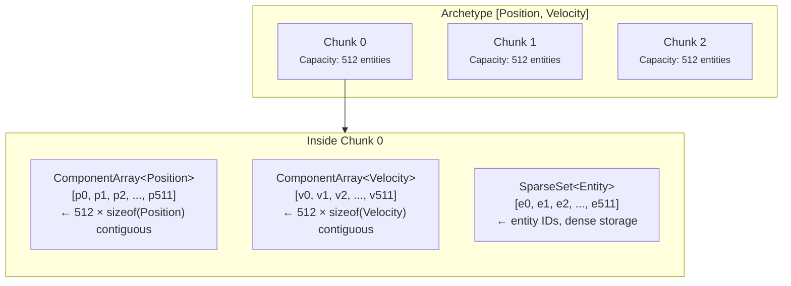
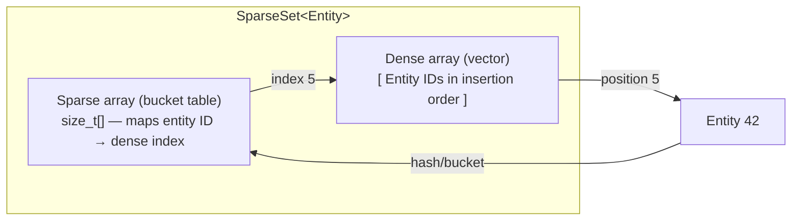
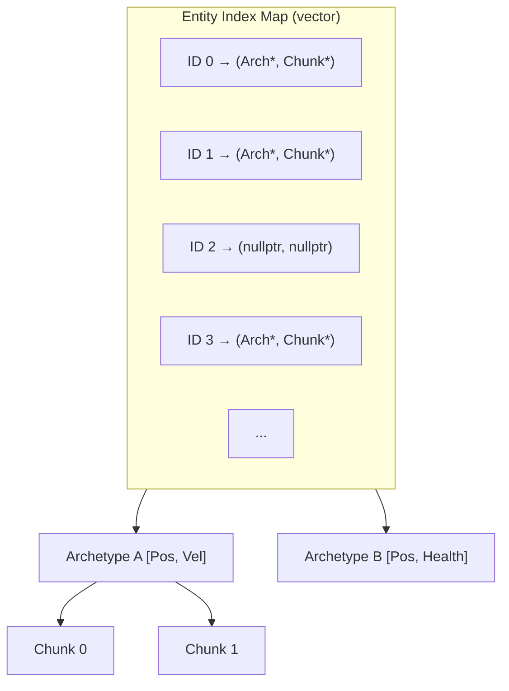
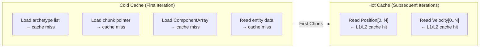

# Memory Layout

Understanding Freyr's memory model is key to writing high-performance systems. This page explains how components,
archetypes, and chunks are arranged in memory, and why it matters for cache performance.

---

## The problem: random memory access

In a traditional OOP game engine, objects are scattered across the heap:

```cpp
class GameObject {
    uint64_t id;
    Transform* transform;    // allocated separately
    Health*    health;       // allocated separately
    Renderable* renderable;  // allocated separately
};
```

Iterating all objects means following pointers to unrelated memory locations — each access is a potential
cache miss. On modern CPUs, a cache miss costs ~100 cycles while a cache hit costs ~4 cycles.

---

## Freyr's solution: archetype chunks

Freyr groups entities by their component signature into **archetypes**. Each archetype divides storage into
fixed-size **chunks**. Inside each chunk, component data is stored in **contiguous arrays**:



### What occupies each chunk

A single `ArchetypeChunk` owns:

- **One `ComponentArray<T>` per registered component type** — `std::vector<T>` contiguous storage
- **A `SparseSet<Entity>`** — entity IDs in dense array for fast iteration

```
Offset 0:   ComponentArray<Position>   → 512 × sizeof(Position)  = contiguous
Offset N:   ComponentArray<Velocity>   → 512 × sizeof(Velocity)  = contiguous
Offset M:   ComponentArray<Health>     → 512 × sizeof(Health)    = contiguous
...
Offset Z:   SparseSet<Entity>          → dense vector of entity IDs
```

---

## The SparseSet data structure

Freyr uses a `SparseSet<T>` for entity storage within each chunk. This is **not** the same as an archetype —
it's an implementation detail of `ArchetypeChunk`.



### SparseSet operations

| Operation | Complexity | Notes |
|-----------|------------|-------|
| `insert(e)` | O(1) amortised | Appends to dense array, updates sparse bucket |
| `remove(e)` | O(1) | Swap-with-last removal in dense array |
| `contains(e)` | O(1) | Two array lookups |
| `getIndex(e)` | O(1) | Returns position in dense array |
| Iteration | O(N) | Linear scan of dense array |

The swap-with-last removal pattern:

```text
Before removal: Dense = [42, 17, 35, 99, 63]
Remove entity 17:
  Dense[1] = Dense[4]  (63)
  Update sparse[63] = 1
  Pop back
After removal:  Dense = [42, 63, 35, 99]
```

This O(1) removal maintains dense iteration order at the cost of losing insertion order stability.

---

## Signature matching

Each archetype has a `Signature` — a bitset indicating which component types it contains:

```cpp
class Signature {
    static constexpr size_t BITSET_SIZE = 128;
    using BitSet = std::bitset<128>;
    std::vector<BitSet> mBitSets;  // extendable for >128 component types
};
```

A signature with 3 component types might look like:

```text
Component IDs:    Position=0, Velocity=1, Health=2, PlayerTag=3, Mesh=4
Signature bits:   [1, 1, 0, 1, 0, 0, 0, ...]
                    ↑  ↑     ↑
                    P  V     PT
```

When you call `Query::Each<Position, PlayerTag>`, Freyr:

1. Builds a signature with bits for Position (0) and PlayerTag (3)
2. Tests every archetype: `querySignature.Match(archetypeSignature)`
3. For each match, iterates every chunk in that archetype

```cpp
bool MatchArchetype(const Archetype* archetype) const {
    const auto& archetypeSignature = archetype->GetSignature();

    // Exclusion filter: reject if any excluded component is present
    if (!mExcludeSignature.IsEmpty()) {
        if (mExcludeSignature.Match(archetypeSignature))
            return false;
    }

    // Inclusion filter: require all included components
    if (!mIncludeSignature.IsEmpty()) {
        return mIncludeSignature.Match(archetypeSignature);
    }

    return true;
}
```

---

## Entity index map

The `ComponentManager` maintains a flat `std::vector<EntityIndex>` mapping entity IDs to their storage location:

```cpp
struct EntityIndex {
    Archetype*      archetype;      // which archetype the entity belongs to
    ArchetypeChunk* archetypeChunk; // which chunk within that archetype
};
```

For entity ID `E`, `mEntityIndexes[E]` gives a direct pointer to the archetype and chunk.
This is a **dense index** — all entity IDs from 0 to `MaxEntities - 1` have a pre-allocated slot.



---

## Archetype migration

When a component is added or removed from an entity, it may need to move to a different archetype.
This involves:

1. **Creating the new signature** (add/remove bits)
2. **Finding or creating** the target archetype
3. **Allocating a slot** in the target chunk
4. **Copying component data** from old chunk to new chunk
5. **Removing** the entity from the old chunk
6. **Updating** the entity index map

```cpp
// Simplified: ComponentManager::CreateOrUpdateEntityIndexWith<Ts...>()
auto signature = actualArchetype->GetSignature();
// Modify signature for added/removed components...

if (signature != actualArchetype->GetSignature()) {
    // Find or create new archetype
    skr::Arc<Archetype> newArchetype = FindOrCreateArchetype(signature);

    // Allocate in new chunk, schedule data migration
    auto newChunk = newArchetype->AddEntity(entity);
    actualChunk->EnqueueTask([=] {
        actualChunk->MoveData(entity, newChunk);
    });

    // Update entity index
    actualChunk     = newChunk;
    actualArchetype = newArchetype.get();
}
```

!!! warning "Migration cost"
    Archetype migration involves copying all component data. While the copy itself is fast (especially for
    trivially copyable types), the allocation and signature matching add overhead. Avoid adding/removing
    components every frame — prefer tag components that remain stable.

---

## Cache behaviour summary



**Key takeaways:**

1. **All components of the same type are contiguous** — iterating 1M positions is a linear cache-friendly scan
2. **Multiple component arrays are traversed in parallel** — `ForEach<Position, Velocity>` strides both arrays
   simultaneously, keeping data in cache
3. **Chunks provide spatial locality** — 512 entities worth of data fits in L2 cache on most CPUs
4. **Archetype separation** — entities with different component sets don't pollute each other's cache lines
5. **Entity index is O(1)** — direct array lookup, no hash or tree traversal

!!! tip "Optimising for cache"
    - Keep components small (ideally ≤ cache line size, 64 bytes)
    - Group frequently-accessed data together (Position + Velocity instead of separate Transform)
    - Use tag components (empty structs) for classification — zero memory overhead
    - Avoid storing pointers inside components (they become invalid during migration)
