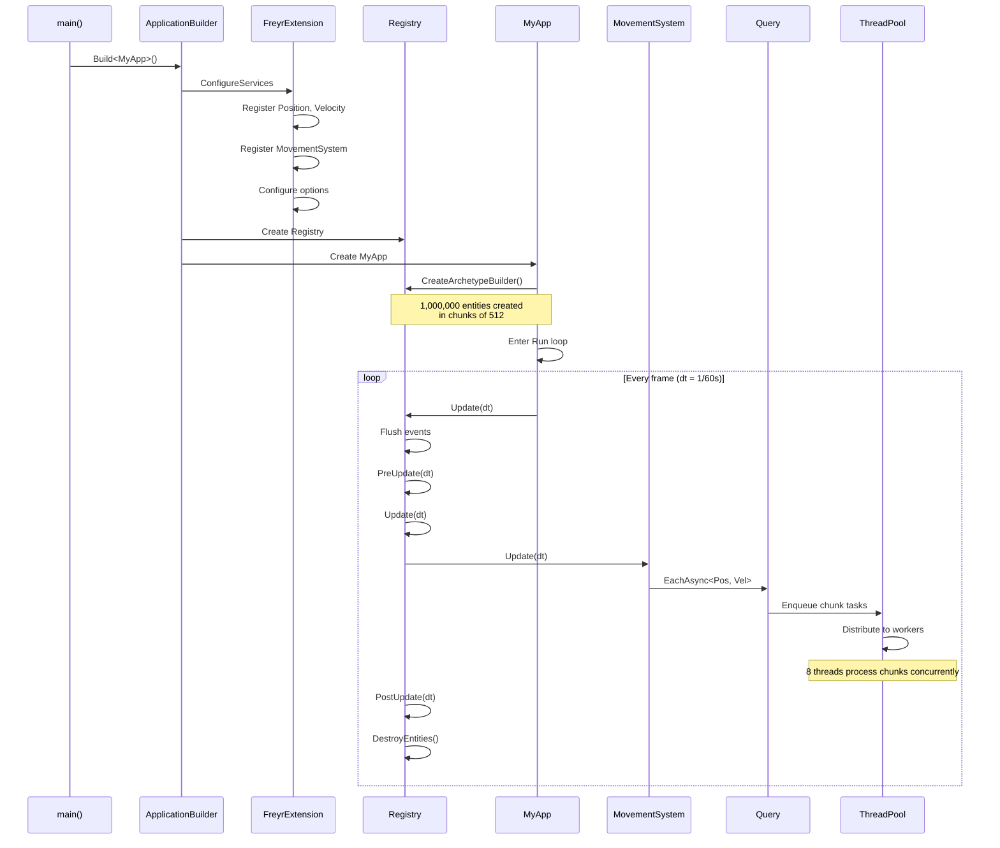
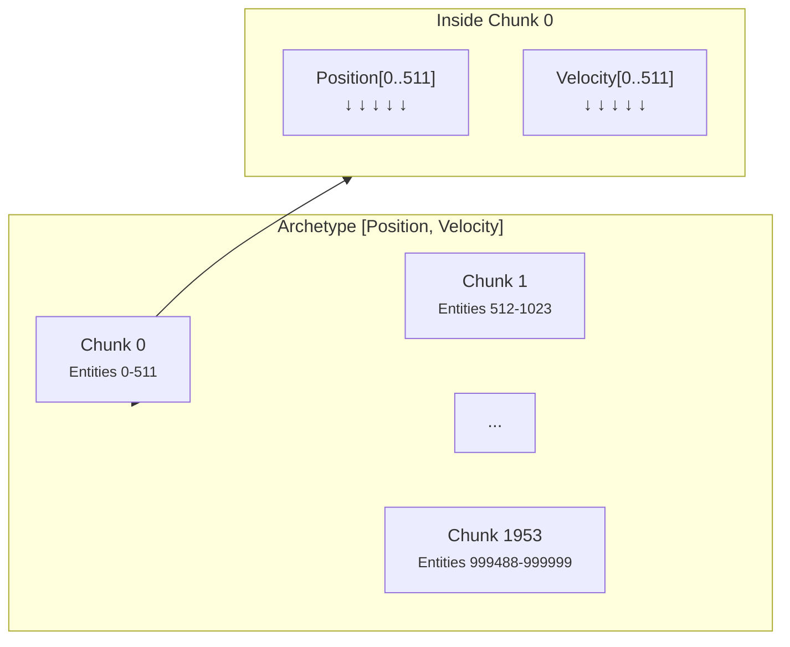

# Quick Start

This guide walks you through building a minimal simulation: entities with `Position` and `Velocity` components
updated by a `MovementSystem`, running in parallel across 8 threads.

---

## 1. Define components

Components are plain data structs that inherit from `fr::Component`. They hold **only data** — no logic, no methods.

```cpp
// components.hpp
#include <Freyr/Freyr.hpp>

struct Position : fr::Component {
    float x = 0.f;
    float y = 0.f;
    float z = 0.f;
};

struct Velocity : fr::Component {
    float dx = 0.f;
    float dy = 0.f;
    float dz = 0.f;
};
```

!!! tip "Default values matter"
    Always provide sensible defaults for all fields. Components are value-initialized (`T {}`) during
    archetype creation, and defaults ensure every entity starts in a valid state.

---

## 2. Define a system

Systems inherit from `fr::System` and override lifecycle hooks. The constructor **must** accept `skr::Arc<fr::Registry>`.

```cpp
// movement_system.hpp
#include <Freyr/Freyr.hpp>
#include "components.hpp"

class MovementSystem : public fr::System {
public:
    explicit MovementSystem(const skr::Arc<fr::Registry>& registry) : System(registry) {}

    void Update(float deltaTime) override {
        // EachAsync → one task per chunk → distributed across all threads
        mRegistry->CreateQuery()
            ->WithLabel("MovementSystem::Integrate")  // (1)!
            ->EachAsync<Position, Velocity>(
                [deltaTime](fr::Entity, Position& pos, const Velocity& vel) {
                    pos.x += vel.dx * deltaTime;
                    pos.y += vel.dy * deltaTime;
                    pos.z += vel.dz * deltaTime;
                });
    }
};
```

1.  Labels appear in Perfetto traces when profiling is enabled. Always label your queries for debuggability.

---

## 3. Define the application

The application creates an `ArchetypeBuilder` to spawn a million entities efficiently at startup.

```cpp
// app.hpp
#include <Freyr/Freyr.hpp>
#include "components.hpp"

class MyApp : public skr::IApplication {
public:
    explicit MyApp(const skr::Arc<skr::ServiceProvider>& sp) : IApplication(sp) {
        mRegistry = sp->GetService<fr::Registry>();

        // Bulk-create 1 million entities — fast path via archetype pre-allocation
        mRegistry->CreateArchetypeBuilder()
            .WithComponent(Position {})
            .WithComponent(Velocity { .dx = 1.f, .dy = 0.5f })
            .WithEntities(1'000'000)
            .Build();
    }

    void Run() override {
        constexpr float dt = 1.0f / 60.0f;
        while (true)          // (1)!
            mRegistry->Update(dt);
    }

private:
    skr::Arc<fr::Registry> mRegistry;
};
```

1.  In a real game you'd have a window event loop (`PollEvents`, `ShouldClose`, etc.). This infinite loop
    demonstrates the conceptual frame structure.

---

## 4. Bootstrap with FreyrExtension

The `FreyrExtension` wires everything together: registers components, configures options, and sets up pipelines.

```cpp
// main.cpp
#include <Freyr/Freyr.hpp>
#include "app.hpp"
#include "components.hpp"
#include "movement_system.hpp"

int main() {
    auto app = skr::ApplicationBuilder()
        .AddExtension<fr::FreyrExtension>([](fr::FreyrExtension& freyr) {
            freyr
                .WithOptions([](fr::FreyrOptionsBuilder& opts) {
                    opts
                        .WithMaxEntities(1'500'000)        // max live entities
                        .WithArchetypeChunkCapacity(512)   // entities per chunk
                        .WithThreadCount(8);               // worker threads
                })
                .WithComponent<Position>()
                .WithComponent<Velocity>()
                .WithPipeline([](fr::PipelineBuilder& pipeline) {
                    pipeline.WithName("Main")
                        .WithRate(60.0f)
                        .WithSystem<MovementSystem>();
                });
        })
        .Build<MyApp>();

    app->Run();
    return 0;
}
```

---

## 5. What happens at runtime



Each frame, the following happens:

```text
Registry::Update(dt)
├─ Flush()                     → merge pending event listeners
├─ PreUpdate(dt)               → all systems: PreUpdate
│  ├─ WaitForAllTasks()
│  └─ DestroyEntities()
├─ Update(dt)                  → all systems: Update  ← systems query here
│  ├─ WaitForAllTasks()
│  └─ DestroyEntities()
└─ PostUpdate(dt)              → all systems: PostUpdate
   ├─ WaitForAllTasks()
   └─ DestroyEntities()
```

---

## 6. Memory layout at runtime

When the million entities are created, the memory looks like this:



With chunk capacity = 512,  1,000,000 entities → 1,954 chunks → 1,954 tasks per `EachAsync` call.
Each chunk is an independent parallel unit.

---

## 7. Verify it works

Build and run:

```bash
cmake -B build -DCMAKE_BUILD_TYPE=Release
cmake --build build --parallel
./build/examples/QuickStart/freyr_quick_start  # if examples enabled
```

Or write your own `main.cpp` using the code above and link against Freyr.

---

## Next steps

- [ECS Overview](../concepts/ecs-overview.md) — understand the model behind the API
- [Architecture](../concepts/architecture.md) — deep dive into Registry internals
- [Registry API](../api/scene.md) — full reference for entity and component operations
- [ArchetypeBuilder](../api/archetype-builder.md) — efficient bulk entity creation
- [PipelineBuilder](../api/pipeline-builder.md) — organize systems into pipelines
- [Parallel Processing guide](../guides/parallel-processing.md) — tune parallelism
