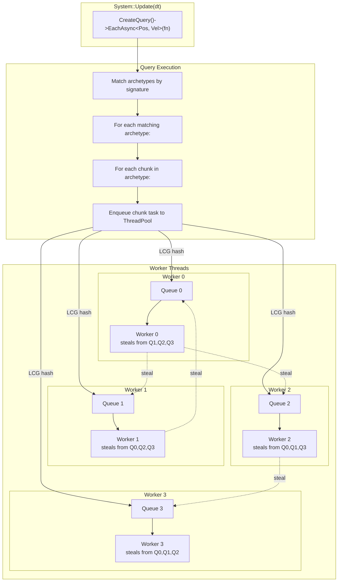

# Parallel Processing

Freyr's parallelism model is built around chunk-level task dispatch. Understanding how work is distributed
and how to choose the right iteration method is key to maximising performance.

---

## The parallelism model



When `EachAsync` is called:

1. Freyr finds all archetypes matching the requested component signature
2. For each matching archetype, every chunk becomes an independent task
3. Tasks are enqueued to per-worker MPMC queues using LCG-based distribution
4. Workers pop tasks from their own queue; idle workers steal from others
5. `ExecuteTasks()` or `WaitForAllTasks()` blocks until all tasks complete

---

## Synchronous vs asynchronous iteration

### `Each` — synchronous

```cpp
mScene->CreateQuery()->Each<Position, Velocity>(
    [dt](fr::Entity e, Position& pos, Velocity& vel) {
        pos.x += vel.dx * dt;
    });
```

- Runs on the calling thread
- Guarantees sequential ordered iteration (by entity ID within each chunk)
- Safe for cross-entity reads/writes
- No synchronisation needed

### `EachAsync` — asynchronous

```cpp
mScene->CreateQuery()->EachAsync<Position, Velocity>(
    [dt](fr::Entity e, Position& pos, Velocity& vel) {
        pos.x += vel.dx * dt;
    });
mScene->ExecuteTasks(); // sync point
```

- Distributes chunks across all worker threads
- Entities are **independent** — no cross-entity communication within the callback
- Requires explicit synchronisation via `ExecuteTasks()` or the scene's built-in sync points
- Best for compute-heavy, embarrassingly parallel workloads

| Method      | Blocking | Thread pool | Entity order | Cross-entity reads | Use for |
|-------------|----------|-------------|--------------|-------------------|---------|
| `Each`      | Yes      | No          | Stable       | Safe              | AI, interactions, debugging |
| `EachAsync` | No       | Yes         | Unstable     | Unsafe            | Physics, movement, particles |

---

## Work stealing

Each worker thread has its own MPMC queue. When `AddTask` is called, the task is pushed to one worker's queue
using LCG-based distribution:

```cpp
void AddTask(auto&& func) {
    mTaskCounter->AddTasks(1);
    mQueueLcgState = mQueueLcgState * LCG_MULTIPLIER + LCG_INCREMENT;
    const auto nextQueue = mQueueLcgState % mWorkerQueues.size();
    mWorkerQueues[nextQueue]->push(std::forward<decltype(func)>(func));
}
```

When a worker's queue is empty, it tries to pop from other workers' queues. This **work stealing** ensures:

- Good load balance even with uneven task durations
- No single point of contention
- Automatic adaptation to heterogeneous workloads

---

## Chunk-level parallelism

Each archetype chunk is the unit of parallel work. One task = one chunk.

```text
System::Update(dt)
  └─ Query::EachAsync<Position, Velocity>
       ├─ Archetype A [Position, Velocity] has 3 chunks
       │    ├─ Task: chunk 0 (512 entities)
       │    ├─ Task: chunk 1 (512 entities)
       │    └─ Task: chunk 2 (512 entities)
       └─ Archetype B [Position, Velocity, Health] has 1 chunk
            └─ Task: chunk 0 (512 entities)
```

### Task count formula

```
Task count  =  Σ  ceiling(chunk_count_per_archetype)
```

For 1,000,000 entities with chunk capacity 512:

```
1,000,000 ÷ 512 = 1,953.125 → 1,954 chunks → 1,954 tasks
```

More chunks = finer parallelism but higher scheduling overhead.
Fewer chunks = less overhead but coarser load balancing.

---

## Overlapping parallel work

To maximise throughput, overlap parallel computation with sequential work:

```cpp
void Update(float dt) override {
    // 1. Start parallel physics integration
    mScene->CreateQuery()->WithLabel("Integrate")
        ->EachAsync<Position, Velocity>([dt](fr::Entity e, Position& pos, Velocity& vel) {
            pos.x += vel.dx * dt;
            pos.y += vel.dy * dt;
        });

    // 2. Do sequential AI work while physics runs in background
    mScene->CreateQuery()->WithLabel("AI Think")
        ->Each<AIState>([dt](fr::Entity e, AIState& ai) {
            ai.thinkTimer -= dt;
            if (ai.thinkTimer <= 0.f)
                ai.nextAction = computeNextAction(ai);
        });

    // 3. Sync — wait for all parallel tasks
    mScene->ExecuteTasks();
    // Now positions are consistent
}
```

### Timeline diagram

```mermaid
gantt
    title Overlapping Parallel Work
    dateFormat  X
    axisFormat  %s

    section Main Thread
    Schedule Physics     : 0, 1
    Sequential AI        : 1, 3
    Sync                 : 3, 4

    section Worker 1
    Process Chunk 0      : 0, 2
    Steal Chunk 3        : 2, 4

    section Worker 2
    Process Chunk 1      : 0, 3
    Idle                 : 3, 4

    section Worker 3
    Process Chunk 2      : 0, 4
```



---

## Synchronisation points

Freyr has implicit and explicit sync points:

### Implicit (inside Scene::Update)

```
PreUpdate  phase → WaitForAllTasks() + DestroyEntities()
Update     phase → WaitForAllTasks() + DestroyEntities()
PostUpdate phase → WaitForAllTasks() + DestroyEntities()
```

### Explicit (user-controlled)

```cpp
mScene->ExecuteTasks(); // flush query aggregator + wait
```

Use explicit sync when you need to interleave parallel and sequential work within a single system.

---

## Avoiding dependencies

The biggest impact on parallel performance is avoiding dependencies between tasks:

```cpp
// BAD: Each entity reads data from another entity
mScene->CreateQuery()->EachAsync<Position>([this](fr::Entity e, Position& p) {
    // This system reads positions from other entities — RACE CONDITION!
    auto otherPos = mScene->GetComponent<Position>(otherEntity);
    p.x += otherPos.x;
});

// GOOD: Independent per-entity work
mScene->CreateQuery()->EachAsync<Position, Velocity>(
    [dt](fr::Entity e, Position& p, Velocity& v) {
        p.x += v.dx * dt; // only reads/writes own data
    });
```

### Golden rules

1. **Don't modify archetype structure during iteration** — adding/removing components is deferred to `DestroyEntities()`
2. **Avoid reading data written by another task in the same frame** — use `ExecuteTasks()` to create sync points
3. **Don't call `Scene::Update` from within an `EachAsync` callback** — undefined behaviour
4. **Don't throw exceptions from callbacks** — behaviour is undefined in parallel execution
