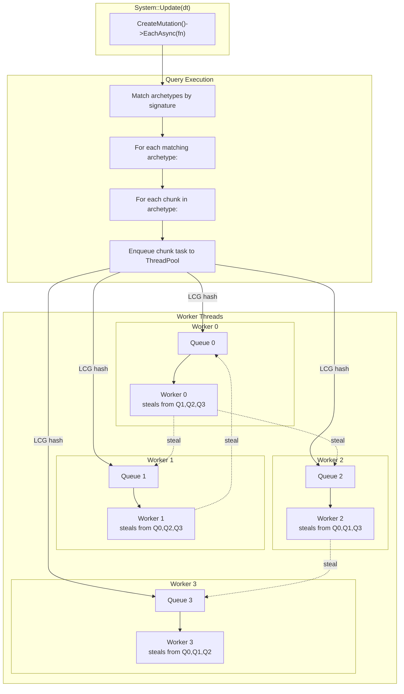

# Parallel Processing

Freyr's parallelism model is built around chunk-level task dispatch. Understanding how work is distributed
and how to choose the right iteration method is key to maximising performance.

---

## The parallelism model


```mermaid
graph TB
    subgraph System["System::Update(dt)"]
        Q["CreateMutation()->EachAsync(fn)"]
    end

    subgraph QueryExec["Query Execution"]
        M["Match archetypes by signature"]
        C["For each matching archetype:"]
        CHUNKS["For each chunk in archetype:"]
        TASK["Enqueue chunk task to ThreadPool"]
    end

    subgraph Workers["Worker Threads"]
        direction LR

        subgraph Pool0["Worker 0"]
            Q0["Queue 0"] --> W0["Worker 0<br/>steals from Q1,Q2,Q3"]
        end

        subgraph Pool1["Worker 1"]
            Q1["Queue 1"] --> W1["Worker 1<br/>steals from Q0,Q2,Q3"]
        end

        subgraph Pool2["Worker 2"]
            Q2["Queue 2"] --> W2["Worker 2<br/>steals from Q0,Q1,Q3"]
        end

        subgraph Pool3["Worker 3"]
            Q3["Queue 3"] --> W3["Worker 3<br/>steals from Q0,Q1,Q2"]
        end
    end

    Q --> M --> C --> CHUNKS --> TASK
    TASK -->|LCG hash| Q0
    TASK -->|LCG hash| Q1
    TASK -->|LCG hash| Q2
    TASK -->|LCG hash| Q3
    W0 -.->|steal| Q1
    W0 -.->|steal| Q2
    W1 -.->|steal| Q0
    W2 -.->|steal| Q3

```

When `EachAsync` is called:

1. The mutation is only **scheduled** into the `MutationAggregator` — no work runs yet
2. At the next flush (`ExecuteTasks()`, or the phase boundaries inside `Registry::Update`),
   Freyr matches the pending filters against archetypes
3. For each matching archetype, every **non-empty** chunk becomes one task, enqueued via
   `ArchetypeChunk::EnqueueTask` after `ThreadPool::StartWorkers()`
4. Tasks land in per-worker MPMC queues using LCG-based distribution
5. Workers pop tasks from their own queue; idle workers steal from others
6. The flush ends with `ThreadPool::WaitForAllTasks()` — the sync point

---

## Synchronous vs asynchronous iteration

### `Each` — synchronous

```cpp
mRegistry->CreateMutation()->Each(
    [dt](fr::Entity e, Position& pos, Velocity& vel) {
        pos.x += vel.dx * dt;
    });
```

- Runs on the calling thread
- Guarantees sequential ordered iteration (by entity ID within each chunk)
- Safe for cross-entity reads/writes
- No synchronisation needed

### `EachAsync` — asynchronous (deferred)

```cpp
mRegistry->CreateMutation()->EachAsync(
    [dt](fr::Entity e, Position& pos, Velocity& vel) {
        pos.x += vel.dx * dt;
    });
mRegistry->ExecuteTasks(); // flush aggregator, run chunk tasks, wait
```

- Only **schedules** a pending mutation; chunk tasks are created at flush time
- Distributes non-empty chunks across all worker threads during the flush
- Entities are **independent** — no cross-entity communication within the callback
- Requires a flush via `ExecuteTasks()` when called outside `Registry::Update`
  (`Update` flushes automatically at each phase boundary)
- Best for compute-heavy, embarrassingly parallel workloads

| Method      | Blocking | Thread pool | Entity order | Cross-entity reads | Use for |
|-------------|----------|-------------|--------------|-------------------|---------|
| `Each`      | Yes      | No          | Stable       | Safe              | AI, interactions, debugging |
| `EachAsync` | No       | Yes         | Unstable     | Unsafe            | Physics, movement, particles |

---

## Work stealing

Each worker thread has its own MPMC queue. When `AddTask` is called, the task is pushed to one worker's queue
using LCG-based distribution:

```cpp
void AddTask(auto&& func) {
    mTaskCounter->AddTasks(1);
    mQueueLcgState = mQueueLcgState * LCG_MULTIPLIER + LCG_INCREMENT;
    const auto nextQueue = mQueueLcgState % mWorkerQueues.size();
    mWorkerQueues[nextQueue]->push(std::forward<decltype(func)>(func));
}
```

When a worker's queue is empty, it tries to pop from other workers' queues. This **work stealing** ensures:

- Good load balance even with uneven task durations
- No single point of contention
- Automatic adaptation to heterogeneous workloads

---

## Chunk-level parallelism

Each archetype chunk is the unit of parallel work. One task = one non-empty chunk
(empty chunks are skipped at flush time).

```text
System::Update(dt)
  └─ Mutation::EachAsync
       ├─ Archetype A [Position, Velocity] has 3 chunks
       │    ├─ Task: chunk 0 (512 entities)
       │    ├─ Task: chunk 1 (512 entities)
       │    └─ Task: chunk 2 (512 entities)
       └─ Archetype B [Position, Velocity, Health] has 1 chunk
            └─ Task: chunk 0 (512 entities)
```

### Task count formula

```
Task count  =  Σ  ceiling(chunk_count_per_archetype)
```

For 1,000,000 entities with chunk capacity 512:

```
1,000,000 ÷ 512 = 1,953.125 → 1,954 chunks → 1,954 tasks
```

More chunks = finer parallelism but higher scheduling overhead.
Fewer chunks = less overhead but coarser load balancing.

---

## Batching deferred work

`EachAsync` defers execution: scheduling only queues a `PendingMutation`, and the chunk
tasks run at the next flush. Batch deferred work with immediate sequential work to
reduce flush overhead:

```cpp
void Update(float dt) override {
    // 1. Schedule parallel physics integration (deferred — no work runs yet)
    mRegistry->CreateMutation()->WithLabel("Integrate")
        ->EachAsync([dt](fr::Entity e, Position& pos, Velocity& vel) {
            pos.x += vel.dx * dt;
            pos.y += vel.dy * dt;
        });

    // 2. Run sequential AI work immediately on the calling thread
    mRegistry->CreateMutation()->WithLabel("AI Think")
        ->Each([dt](fr::Entity e, AIState& ai) {
            ai.thinkTimer -= dt;
            if (ai.thinkTimer <= 0.f)
                ai.nextAction = computeNextAction(ai);
        });

    // 3. Flush — runs all scheduled chunk tasks, then waits
    mRegistry->ExecuteTasks();
    // Now positions are consistent
}
```

Note there is no background overlap here: the `Each` in step 2 runs before the
scheduled physics tasks start in step 3. The win is batching — both mutations flush
together. Inside `Registry::Update` no explicit `ExecuteTasks()` is needed because
each phase boundary flushes automatically (see below).

### Timeline diagram


```mermaid
gantt
    title Deferred Mutation Flush
    dateFormat  X
    axisFormat  %s

    section Main Thread
    Schedule Physics     : 0, 1
    Sequential AI        : 1, 3
    Flush + Sync         : 3, 4

    section Worker 1
    Idle                 : 0, 3
    Process Chunk 0      : 3, 4

    section Worker 2
    Idle                 : 0, 3
    Process Chunk 1      : 3, 4

    section Worker 3
    Idle                 : 0, 3
    Process Chunk 2      : 3, 4
```

---

## Synchronisation points

Freyr has implicit and explicit sync points:

### Implicit (inside Registry::Update)

`Update` starts workers once, then after each of `PreUpdate` / `Update` / `PostUpdate`:

```
systems run → WaitForAllTasks() → FlushComponentSync()
            → ExecutePendingMutations() → DestroyEntities()
```

Workers are stopped after `PostUpdate` drains. `MutationAggregator::Flush` itself also
brackets chunk dispatch with `StartWorkers()` / `WaitForAllTasks()`.

### Explicit (user-controlled)

```cpp
mRegistry->ExecuteTasks(); // hierarchy sync + pending mutations + StartTasks
                           // + aggregator flush + WaitForAllTasks
```

Use explicit flush when you schedule `EachAsync` work outside `Registry::Update`.

---

## Avoiding dependencies

The biggest impact on parallel performance is avoiding dependencies between tasks:

```cpp
// BAD: Each entity reads data from another entity
mRegistry->CreateMutation()->EachAsync([this](fr::Entity e, Position& p) {
    // This system reads positions from other entities — RACE CONDITION!
    auto otherPos = mRegistry->GetComponent<Position>(otherEntity);
    p.x += otherPos.x;
});

// GOOD: Independent per-entity work
mRegistry->CreateMutation()->EachAsync(
    [dt](fr::Entity e, Position& p, Velocity& v) {
        p.x += v.dx * dt; // only reads/writes own data
    });
```

### Golden rules

1. **Don't modify archetype structure during iteration** — `AddComponent` / `RemoveComponent`
   are queued as pending mutations (`ExecutePendingMutations`), and `DestroyEntity` is
   deferred to `DestroyEntities()` at the phase boundary
2. **Avoid reading data written by another task in the same frame** — use `ExecuteTasks()` to create sync points
3. **Never call `Registry::Update` from within an `Each` / `EachAsync` callback** — undefined behaviour
4. **Don't throw exceptions from callbacks** — behaviour is undefined in parallel execution
