# Profiling with Perfetto

Freyr integrates with [Perfetto](https://perfetto.dev) to produce detailed execution traces. Traces can be
opened in the Perfetto UI to visualise system timings, chunk iteration durations, and thread utilisation.

---

## Enable profiling

Define `FREYR_PROFILING` before building:

=== "CMake option"
    ```bash
    cmake -B build -DFREYR_PROFILING=ON -DCMAKE_BUILD_TYPE=RelWithDebInfo
    ```
=== "Compiler flag"
    ```cmake
    target_compile_definitions(my_app PRIVATE FREYR_PROFILING)
    ```

!!! note "Zero overhead when disabled"
    When the flag is absent, all profiling macros compile to no-ops with zero runtime overhead.

---

## Basic usage

Wrap the section you want to trace with `BeginProfiling` / `EndProfiling`:

```cpp
void Run() override {
    mRegistry->BeginProfiling();

    for (int i = 0; i < 200; i++)
        mRegistry->Update(1.0f / 60.0f);

    mRegistry->EndProfiling(); // flushes the trace file to disk
}
```

`EndProfiling` writes a `.pftrace` file to the working directory (e.g. `freyr_trace_<timestamp>.pftrace`).

---

## Viewing the trace

1. Open [ui.perfetto.dev](https://ui.perfetto.dev) in Chrome or Edge
2. Click **Open trace file** and select the `.pftrace` file
3. Navigate the timeline to inspect each system and chunk

### What you'll see

```mermaid
gantt
    title Perfetto Trace View (simplified)
    dateFormat  X
    axisFormat  %s

    section Thread 0 (Main)
    Registry::Update       : 0, 10
    PreUpdate           : 0, 2
    Update              : 2, 8
    PostUpdate          : 8, 10

    section Thread 1 (Worker)
    Physics::Integrate Chunk 0 : 2, 4
    Physics::Integrate Chunk 4 : 5, 7

    section Thread 2 (Worker)
    Physics::Integrate Chunk 1 : 2, 5
    Physics::Integrate Chunk 5 : 6, 8

    section Thread 3 (Worker)
    Physics::Integrate Chunk 2 : 2, 3
    Physics::Integrate Chunk 3 : 3, 4
    AI::Think Chunk 0          : 4, 8
```



You will see:

- **One track per thread** (main thread + each worker thread)
- **Named spans** for each labelled `Mutation::Each` / `Mutation::EachAsync` call
- **System lifecycle boundaries** — `PreUpdate`, `Update`, `PostUpdate` per pipeline
- **Perfetto categories** — `FREYR` for internal events, `USER` for user code

---

## Custom spans

Add your own named spans around any code section:

```cpp
void Update(float dt) override {
    mRegistry->BeginTrace("CollisionBroadphase");
    runBroadphase();
    mRegistry->EndTrace();

    mRegistry->BeginTrace("CollisionNarrowphase");
    runNarrowphase();
    mRegistry->EndTrace();
}
```

Spans are nested under the calling thread's track in the Perfetto UI.

---

## Labelling iterations

Set a label via `WithLabel` before iterating:

```cpp
mRegistry->CreateMutation()
    ->WithLabel("Physics::Integrate")
    ->Each(fn);

mRegistry->CreateMutation()
    ->WithLabel("Render::CullFrustum")
    ->EachAsync(fn);
```

Without a label, the lambda's type name is used (often unreadable like `main::{lambda(auto:1)#1}`).
**Always use explicit labels** in any code you want to profile.

---

## Profiling example

The `examples/Profiling` directory contains a profiling-ready scenario:

```cpp
mRegistry->BeginProfiling();

// 2M entities with Position only
mRegistry->CreateArchetypeBuilder()
    .WithComponent(Position {})
    .WithEntities(2'000'000)
    .Build();

// 2M entities with Position + Velocity
mRegistry->CreateArchetypeBuilder()
    .WithComponent(Position {})
    .WithComponent(Velocity {})
    .WithEntities(2'000'000)
    .Build();

for (auto i = 0; i < 100; i++)
    mRegistry->Update(1.0f);

mRegistry->EndProfiling();
```

Build and run:

```bash
cmake -B build -DCMAKE_BUILD_TYPE=Release -DFREYR_PROFILING=ON
cmake --build build --target freyr_profiling_example
./build/examples/Profiling/freyr_profiling_example
```

Then open the resulting trace in [ui.perfetto.dev](https://ui.perfetto.dev).

---

## What to look for

### Chunk iteration time

Select a chunk span and check its duration. Compare across different chunks:

- If all chunks take similar time → workload is homogeneous
- If some chunks take much longer → load imbalance (try smaller chunks)

### Thread utilisation

Look at the worker tracks:

- **All workers busy** → good utilisation
- **Some workers idle** → imbalance (too few chunks, or work stealing is insufficient)
- **All workers idle while main thread runs** → expected — main thread does sequential work

### Profiling overhead

| Aspect | Impact |
|--------|--------|
| Trace event emission | ~50-100 ns per event |
| File write | ~100 MB/s (bounded by disk) |
| Memory | ~10-20 MB buffer (configurable) |

Profiling overhead is generally negligible for workloads processing >100K entities.

---

## Tips

- Profile **Release** builds — Debug builds have much higher per-entity overhead that distorts results
- Run multiple warm-up frames before the profiled section to avoid cold-cache skew
- Test different chunk capacities to find the optimal task granularity
- Use the **Slice details** panel in Perfetto to see exact durations and thread assignments per chunk
- Enable **Flow events** in Perfetto to track task scheduling latency
- For long profiling sessions, reduce the sampling frequency to keep file sizes manageable
